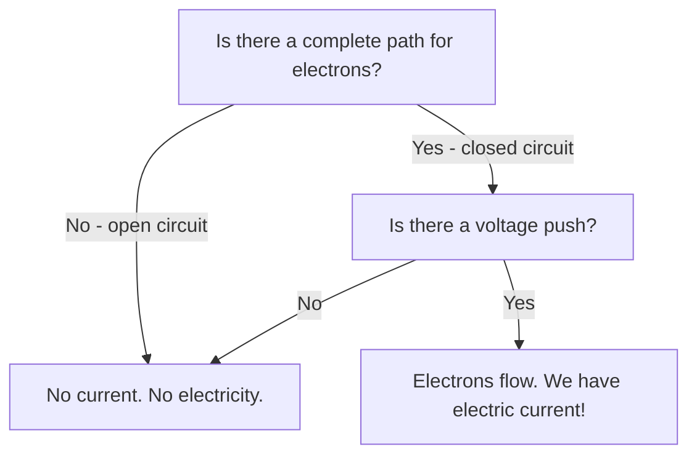
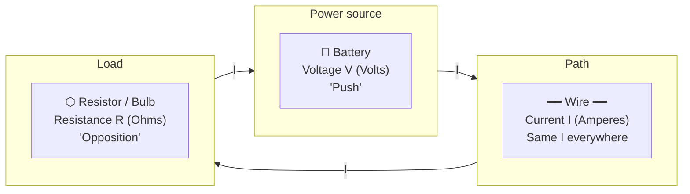
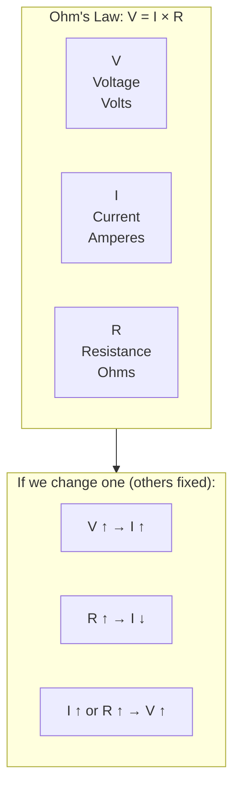
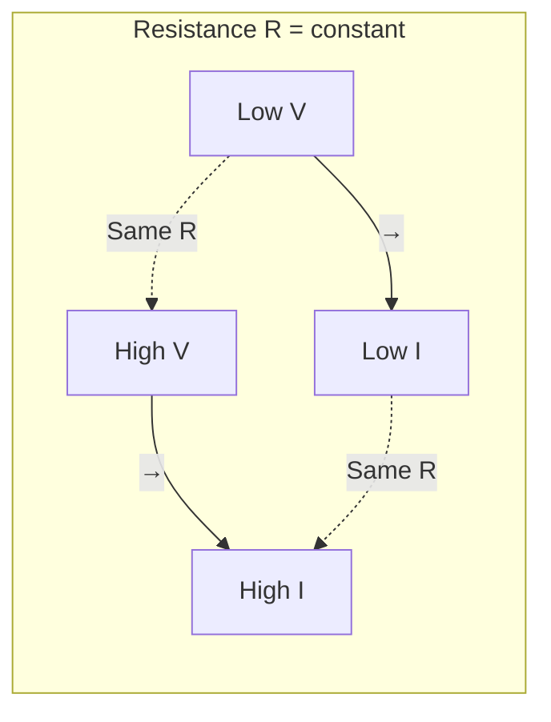
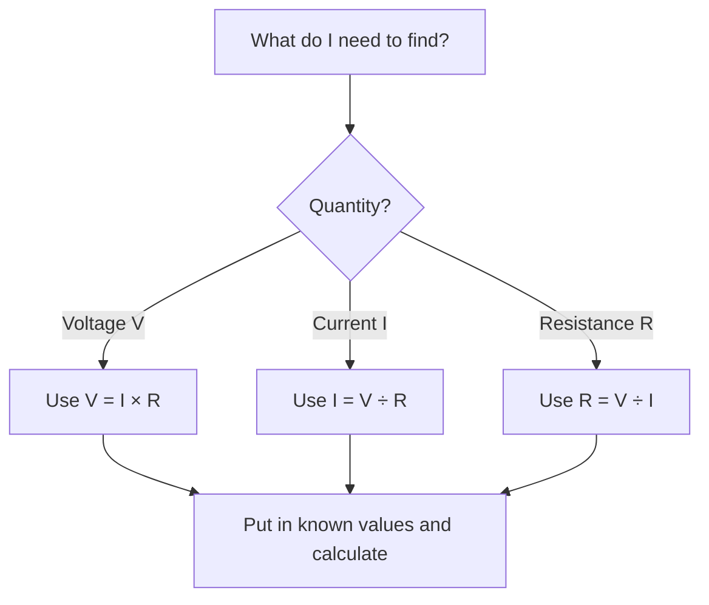

# Chapter 1: Inside Matter – Atoms, Charges & Electricity

**Part 1: Electronics & IoT | Grade 6**

---

## What Is Everything Made Of?

**Figure 1.1 – From matter to atoms:** Everything we see and touch is made of matter; matter is made of atoms.


Look around you. Your desk, your pencil, the wire of a charger, the screen you are reading on—even your own hands—are all made of the same kind of tiny building blocks. Scientists call these building blocks **atoms**. Just as a wall is made of many bricks, everything in the world is made of many, many atoms. They are so small that you cannot see them with your eyes; you need very powerful microscopes to “see” them. A single drop of water has more atoms in it than there are people on Earth!

| Idea | Simple explanation |
|------|---------------------|
| Atom | The smallest unit of ordinary matter that still has the properties of an element (e.g. copper, carbon). |
| Matter | Anything that has mass and takes up space (solids, liquids, gases). |
| Element | A pure substance made of only one type of atom (e.g. gold, oxygen, silicon). |

**Real-life link:** When you touch a metal railing, you are touching trillions of atoms. When you switch on a light, electrons (tiny parts of atoms) move through the wire and make the bulb glow. So electricity is connected to the same “stuff” that everything is made of—atoms.

---

## Inside an Atom

**Figure 1.2 – Structure of an atom (simplified):** The nucleus has protons and neutrons; electrons move around it.

```
                    electrons (negative)
                         •
                    •         •
                         •
              +++++++++++++++++++
              +  NUCLEUS        +
              +  protons (+)    +
              +  neutrons (0)   +
              +++++++++++++++++++
                         •
                    •         •
                         •
```

An atom is like a tiny solar system. In the centre there is a **nucleus** (like the Sun), and around it there are even smaller particles. The three main parts you need to know are:

| Part | Charge | Where it is | What it does |
|------|--------|-------------|--------------|
| **Proton** | Positive (+) | Inside the nucleus | Helps hold the atom together; number of protons decides the *element* (e.g. 6 protons = carbon). |
| **Electron** | Negative (–) | Outside the nucleus, moving around | Can leave one atom and move to another; **flow of electrons = electricity**. |
| **Neutron** | No charge (neutral) | Inside the nucleus | Helps keep the nucleus stable; no electric charge. |

**Exam tip:** The particle with a **negative charge** is the **electron**. Electrons are the ones that move when we use electricity.

**Real-life link:** In a battery, chemical reactions push electrons out from one terminal (negative) and pull them in at the other (positive). When you connect a wire and a bulb, those moving electrons carry energy and make the bulb glow.

---

## What Is Electricity?

**Flowchart 1.1 – When do we have electricity?** Electricity needs a closed path and moving electrons.



Electricity is **not** a thing you can hold. It is the **flow of electrons** from one place to another. If electrons do not move, there is no electric current—even if the wire is full of electrons. Think of a pipe full of water: water only “does work” when it *flows*. Similarly, electrons only give us light, sound, or motion when they *flow*.

| Term | Meaning |
|------|--------|
| Electricity (in everyday use) | The flow of electrons in a path (e.g. a wire). |
| Electric current | The amount of charge (electrons) passing a point per second; measured in Amperes (A). |
| No flow | If the path is broken (open circuit), electrons cannot flow, so there is no electricity. |

**Figure 1.5 – Simple circuit (closed vs open):** When the path is complete, current flows; when it is broken, current stops.

```
  CLOSED CIRCUIT (current flows)          OPEN CIRCUIT (no current)
  --------------------------------        -------------------------------
       +  [Battery]  -                          +  [Battery]  -
       |      |      |                          |      |      |
       +------+------+                          +      X      -
       |   Wire     |                          |   (break)   |
       +------+------+                          +-------------+
       |   Bulb     |                                 
       +------+------+                          Bulb does NOT glow
       Electrons flow → Bulb glows
```

**Real-life examples:**

- **Light bulb:** Electrons flow through the filament; it gets hot and glows.
- **Phone charging:** Electrons move from the socket through the cable into the battery.
- **Lightning:** A huge rush of electrons through the air from clouds to the ground.

---

## A Little History

The idea that matter is made of small particles goes back to ancient thinkers, but the **modern picture of the atom** started in the 1800s and early 1900s:

- **John Dalton** (around 1808) proposed that matter is made of atoms.
- **J.J. Thomson** (1897) discovered the **electron** (the negative particle).
- **Ernest Rutherford** (early 1900s) showed that the atom has a tiny, heavy nucleus.
- **Niels Bohr** (1913) proposed a simple model of electrons moving in orbits around the nucleus.

Their work helped us understand why some materials conduct electricity (electrons can move easily) and others do not.

---

## One Level Higher: Voltage, Current, Resistance, and Ohm’s Law

To go a bit deeper, we use three ideas that engineers and electricians use every day. They are linked by **Ohm’s Law**.

**Figure 1.3 – Simple circuit (Mermaid):** Voltage source pushes current through the circuit; resistance limits the flow.



**Figure 1.3b – Voltage–current–resistance relationship (Ohm’s Law):** How V, I, and R affect each other.



**Figure 1.3c – Current vs voltage (qualitative):** For a fixed resistance R, more voltage means more current.



### Voltage (V)

**Voltage** is like the “push” that makes electrons want to move. It is measured in **Volts (V)**.

- A battery gives a voltage between its two terminals (e.g. 1.5 V for a small cell, 9 V for a square battery).
- Higher voltage (with a proper circuit) means a stronger push, so more electrons can flow—like turning up the pressure in a water pipe.

| Example | Approximate voltage |
|--------|----------------------|
| AA battery | 1.5 V |
| USB (phone charger) | 5 V |
| Car battery | 12 V |
| Home socket (India) | 230 V (dangerous—never touch) |

### Current (I)

**Current** is *how many* electrons pass through a point in the circuit every second. It is measured in **Amperes**, or **Amps (A)**.

- A small LED might need only 0.02 A (20 milliamps).
- A bulb might use 0.5 A. More current usually means more brightness or more power, but too much can damage parts (like an LED) or cause heating.

### Resistance (R) – What Are Ohms?

**Resistance** is how much the material “holds back” the flow of electrons. The unit of resistance is the **Ohm**, written as **Ω** (the Greek letter omega). One **ohm (1 Ω)** means: when we apply **1 volt** across that thing, **1 ampere** of current will flow through it. So:

- **Ohm** = unit of resistance.
- **More ohms** = more opposition to current = less current for the same voltage.
- **Fewer ohms** = less opposition = more current for the same voltage.

Wires have very **low** resistance (a fraction of an ohm over short lengths). Resistors are components that add a **controlled** resistance (e.g. 100 Ω, 330 Ω, 1 kΩ) to limit current and protect parts like LEDs.

| Resistance | Meaning (rough idea) |
|------------|-----------------------|
| 0 Ω (wire) | No opposition; current flows easily (limited by the rest of the circuit). |
| 330 Ω | Moderate opposition; often used with LEDs on a 5 V or 9 V supply. |
| 10 kΩ | High opposition; only a small current flows for the same voltage. |

### Ohm’s Law – The Three Forms

A scientist named **Georg Simon Ohm** (1789–1854) found that voltage, current, and resistance are related in a simple way:

**Voltage = Current × Resistance**  
\[ V = I \times R \]

From this one equation we can find **any one** of the three if we know the other two:

| To find | Formula | In words |
|---------|---------|----------|
| **Voltage (V)** | \( V = I \times R \) | Multiply current by resistance. |
| **Current (I)** | \( I = \frac{V}{R} \) or I = V ÷ R | Divide voltage by resistance. |
| **Resistance (R)** | \( R = \frac{V}{I} \) or R = V ÷ I | Divide voltage by current. |

**Figure 1.4 – Ohm’s Law triangle:** Cover the quantity you want to find; the remaining two show the operation.  
- Cover **V** → I and R are side by side → **V = I × R**  
- Cover **I** → V is over R → **I = V ÷ R**  
- Cover **R** → V is over I → **R = V ÷ I**

```
        V
       /|\
      / | \
     /  |  \
    I --+-- R
        |
   V = I × R   |   I = V ÷ R   |   R = V ÷ I
```

### Worked Examples Using Ohm’s Law

**Example 1 – Finding voltage (V)**  
A current of 0.02 A (20 mA) flows through a resistor of 330 Ω. What is the voltage across the resistor?

- **Formula:** V = I × R  
- **V** = 0.02 × 330 = **6.6 V**  
So the voltage across the resistor is **6.6 volts**.

---

**Example 2 – Finding resistance (R)**  
A 9 V battery is connected to an LED. We want the current through the LED to be 0.02 A. The LED itself “uses” about 2 V. So the voltage across the resistor must be 9 − 2 = 7 V. What resistor value should we use?

- **Formula:** R = V ÷ I  
- **R** = 7 ÷ 0.02 = **350 Ω**  
We pick the nearest standard value, e.g. **330 Ω** or **390 Ω**. So we need a resistor of about **330 Ω** to limit the current safely.

---

**Example 3 – Finding current (I)**  
A 12 V battery is connected across a resistor of 600 Ω. How much current flows?

- **Formula:** I = V ÷ R  
- **I** = 12 ÷ 600 = **0.02 A** (or 20 mA).  
So **0.02 amperes** (20 milliamps) of current flows.

---

**Example 4 – Another voltage calculation**  
A 1.5 V cell is connected to a small bulb. The current is 0.3 A. What is the resistance of the bulb (approximately)?

- **Formula:** R = V ÷ I  
- **R** = 1.5 ÷ 0.3 = **5 Ω**  
So the bulb has a resistance of about **5 ohms**.

**Flowchart 1.2 – Using Ohm’s Law:** Decide what you need to find, then use the right formula.



**Summary of the relationship:** If voltage goes up and resistance stays the same, current goes up. If we add more resistance (e.g. a bigger resistor), current goes down. That is why we put a resistor in series with an LED—to limit current so the LED does not burn out.

---

## Key Points to Remember

| Point | Short explanation |
|-------|--------------------|
| Everything is made of atoms | Atoms are the tiny building blocks of matter. |
| Atom has protons, electrons, neutrons | Protons (+) and neutrons in nucleus; electrons (–) outside. |
| Electricity = flow of electrons | No flow → no current → no “electricity” in the wire. |
| Electrons carry negative charge | They are the particles that move in wires and circuits. |
| Voltage (V), current (I), resistance (R) | Voltage = push (Volts); current = flow (Amperes); resistance = opposition (Ohms). |
| Ohm’s Law | V = I × R; to find **V** use V = I × R; to find **I** use I = V ÷ R; to find **R** use R = V ÷ I. |
| Ohm (Ω) | Unit of resistance; 1 Ω means 1 V produces 1 A through that resistance. |

---

## Multiple Choice Questions

Choose the correct option. Answers are given at the end.

1. Everything around us is made of tiny particles called  
   (a) cells  
   (b) atoms  
   (c) molecules  
   (d) electrons  

2. The particle with a negative charge inside an atom is the  
   (a) proton  
   (b) neutron  
   (c) electron  
   (d) nucleus  

3. Electricity is best described as  
   (a) a type of wire  
   (b) the flow of electrons  
   (c) a kind of energy stored in batteries only  
   (d) the same as light  

4. Where are protons found in an atom?  
   (a) Moving around the nucleus  
   (b) Inside the nucleus  
   (c) Outside the atom  
   (d) In the electron cloud  

5. The neutron has  
   (a) positive charge  
   (b) negative charge  
   (c) no charge  
   (d) both positive and negative charge  

6. Who discovered the electron?  
   (a) Dalton  
   (b) Rutherford  
   (c) J.J. Thomson  
   (d) Bohr  

7. Voltage is measured in  
   (a) Amperes  
   (b) Ohms  
   (c) Volts  
   (d) Watts  

8. Current is measured in  
   (a) Volts  
   (b) Ohms  
   (c) Amperes  
   (d) Joules  

9. Resistance is measured in  
   (a) Volts  
   (b) Amperes  
   (c) Ohms  
   (d) Hertz  

10. Ohm’s Law is written as  
    (a) V = I + R  
    (b) V = I × R  
    (c) I = V + R  
    (d) R = V − I  

11. If we increase voltage and keep resistance the same, current  
    (a) decreases  
    (b) stays the same  
    (c) increases  
    (d) becomes zero  

12. Why do we need a resistor with an LED?  
    (a) To increase voltage  
    (b) To limit current so the LED does not burn  
    (c) To make the LED brighter  
    (d) To store charge  

13. A typical AA battery has a voltage of about  
    (a) 9 V  
    (b) 1.5 V  
    (c) 230 V  
    (d) 12 V  

14. When we switch off a bulb, what happens to the electrons in the wire?  
    (a) They disappear  
    (b) They stop flowing  
    (c) They become positive  
    (d) They leave the wire  

15. Matter is anything that  
    (a) can conduct electricity  
    (b) has mass and takes up space  
    (c) is visible only under a microscope  
    (d) is found only in solids  

16. The nucleus of an atom contains  
    (a) only electrons  
    (b) protons and neutrons  
    (c) only neutrons  
    (d) electrons and protons  

17. Georg Simon Ohm is famous for  
    (a) discovering the electron  
    (b) the law relating voltage, current, and resistance  
    (c) inventing the battery  
    (d) discovering the nucleus  

18. Which of these is a real-life example of flow of electrons?  
    (a) A still battery  
    (b) A glowing bulb  
    (c) A switched-off wire  
    (d) An unplugged cable  

19. “Conventional current” is often said to flow  
    (a) from negative to positive  
    (b) from positive to negative  
    (c) only in batteries  
    (d) only in insulators  

20. An element is a substance made of  
    (a) many types of atoms  
    (b) only one type of atom  
    (c) only electrons  
    (d) mixed charges  

21. Lightning is an example of  
    (a) static electricity only  
    (b) a huge flow of electrons through the air  
    (c) DC current from clouds  
    (d) low voltage  

22. Who proposed that matter is made of atoms (modern atomic theory)?  
    (a) J.J. Thomson  
    (b) John Dalton  
    (c) Niels Bohr  
    (d) Georg Ohm  

23. In the equation V = I × R, if R increases and V stays the same, I  
    (a) increases  
    (b) decreases  
    (c) stays the same  
    (d) becomes negative  

24. The unit of current is named after  
    (a) André-Marie Ampère  
    (b) Georg Ohm  
    (c) Alessandro Volta  
    (d) James Watt  

25. Electrons in a wire move when  
    (a) the wire is long  
    (b) the circuit is closed and there is a voltage  
    (c) the wire is thick  
    (d) the wire is cold  

---

**Answers:** 1-b, 2-c, 3-b, 4-b, 5-c, 6-c, 7-c, 8-c, 9-c, 10-b, 11-c, 12-b, 13-b, 14-b, 15-b, 16-b, 17-b, 18-b, 19-b, 20-b, 21-b, 22-b, 23-b, 24-a, 25-b.
