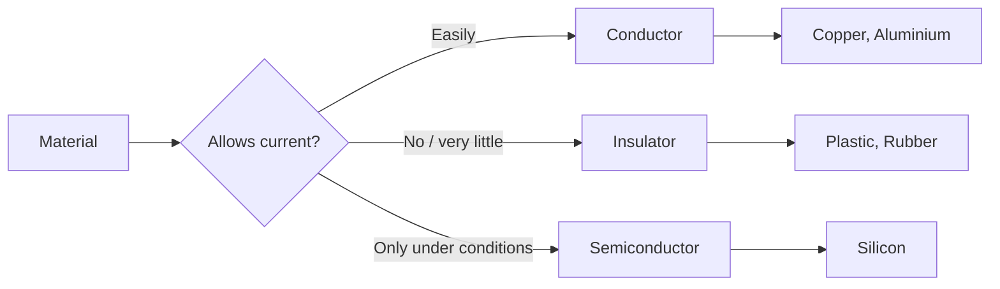
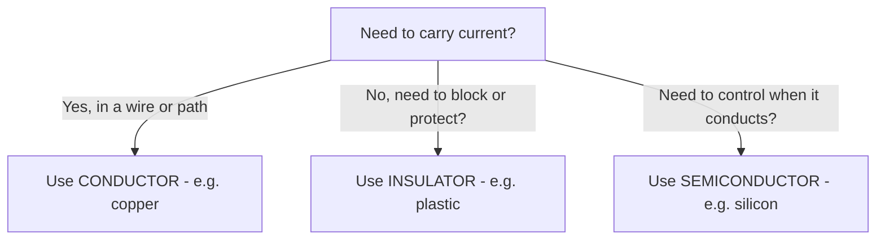

# Chapter 2: Conductors, Insulators & Semiconductors

**Part 1: Electronics & IoT | Grade 6**

---

## Why Don’t All Materials Behave the Same?

**Figure 2.1 – How materials behave with electricity:** Three types—conductors, insulators, semiconductors.



Have you ever wondered why we use metal inside wires and plastic or rubber on the outside? Or why you get a shock when you touch a metal tap but not when you touch a wooden door? The reason is that **different materials allow electricity to pass through them differently**. Some let electrons flow easily; others block the flow; and some do both depending on conditions. Scientists divide materials into three main groups: **conductors**, **insulators**, and **semiconductors**.

| Type | Allows electricity? | Examples (everyday) |
|------|---------------------|----------------------|
| **Conductor** | Yes, easily | Metal wires, keys, coins, water (when impure) |
| **Insulator** | No (or very little) | Plastic, rubber, wood, glass, dry air |
| **Semiconductor** | Only under special conditions | Silicon (in chips, phones, solar panels) |

**Figure 2.2 – Wire cross-section:** Conductor inside (carries current); insulator outside (safety).

```
    ============================================
    |  Plastic / Rubber (INSULATOR - outside)  |
    |  ======================================  |
    |  |  Copper (CONDUCTOR - inside)      |  |
    |  |     current flows here            |  |
    |  ======================================  |
    ============================================
```

**Real-life link:** The cord of a table lamp has metal (copper) inside to carry current and plastic or rubber on the outside so you can hold it safely. If the outside were metal too, you could get a shock!

---

## Conductors

**Conductors** are materials through which electricity (flow of electrons) can pass **easily**. In conductors, some electrons are loosely bound to their atoms and can move when we apply a voltage. That movement is electric current.

| Property | Conductors |
|----------|------------|
| Definition | Materials that allow electric current to flow easily |
| Why they conduct | Have “free” or loosely bound electrons that can move |
| Common examples | Copper, aluminium, iron, silver, gold |
| Uses | Wires, cables, plugs, circuit tracks, motor windings |

**Why copper is used in wires:** Copper is a very good conductor, is not too expensive, and can be drawn into thin wires. Silver conducts even better but is costly; aluminium is lighter and used for long power lines.

**Real-life examples:**

- **House wiring:** Copper wires carry current to lights and sockets.
- **Earphones:** Thin copper strands inside the cable carry the sound signal.
- **Battery terminals:** Metal contacts are conductors so current can enter and leave the battery.

---

## Insulators

**Insulators** are materials that **do not allow** (or allow very little) electric current to flow. Their electrons are held tightly to the atoms, so they do not move easily. Insulators protect us from electric shock and keep current inside the wires.

| Property | Insulators |
|----------|------------|
| Definition | Materials that block or greatly resist electric current |
| Why they insulate | Electrons are tightly bound; very few “free” electrons |
| Common examples | Plastic, rubber, wood, glass, ceramic, dry air |
| Uses | Wire coating, plug bodies, switch covers, tool handles, towers |

**Real-life examples:**

- **Plug and wire:** Plastic around the wire and the plug body are insulators.
- **Wooden ladder:** Electricians use wooden or fibreglass ladders so current does not pass through them.
- **Shoes:** Rubber soles can help insulate you from the floor when working with electricity (but never rely only on shoes near live wires).

---

## Semiconductors

**Semiconductors** are in-between: they do **not** conduct as well as metals, but they are **not** as blocking as insulators. Under special conditions (e.g. added impurities, light, heat, or electric fields), they can conduct. That “switchable” behaviour is what makes computers, phones, and solar cells possible.

| Property | Semiconductors |
|----------|----------------|
| Definition | Materials that conduct only under certain conditions |
| Most common example | Silicon |
| Why “semi”? | Sometimes behave like conductors, sometimes like insulators |
| Uses | Chips, computers, mobile phones, LEDs, solar panels, sensors |

**Real-life examples:**

- **Mobile phone:** The “brain” of the phone is a chip made of silicon (a semiconductor).
- **Solar panel:** Sunlight makes the semiconductor conduct and produce electric current.
- **LED:** An LED is made of semiconductor material that glows when current passes through it.

---

## Why Semiconductors Are Special

Semiconductors are special because we can **control** when they conduct. By adding tiny amounts of other elements (called *doping*) and by building tiny structures on a chip, we can make:

- **Switches** that turn current on or off (billions of them in one chip).
- **Amplifiers** that make weak signals stronger.
- **Sensors** that react to light, temperature, or magnetic fields.

So they are called **“semi” conductors**—halfway between conductors and insulators, and very useful because of that.

---

## A Little History

- **Michael Faraday** (1791–1867) and others studied which materials conduct and which do not.
- **Thomas Edison** noticed that certain materials could conduct under some conditions (early semiconductor effect).
- **Silicon** and **germanium** became important in the 1940s and 1950s for making transistors.
- **The first transistor** (1947) was made at Bell Labs by Bardeen, Brattain, and Shockley using a semiconductor. This invention led to modern computers and electronics.

---

## One Level Higher: Band Gap

In conductors, there are energy levels (bands) where electrons can move freely. In insulators, the “gap” between where electrons sit and where they could move is too big, so they hardly move. In **semiconductors**, this gap (called **band gap**) is small. So with a little extra energy—from heat, light, or an electric field—electrons can “jump” and conduct. That is why semiconductors respond to light (solar cells, cameras) and temperature (sensors).

| Material type | Band gap idea | Conducts? |
|---------------|----------------|-----------|
| Conductor | No real gap; electrons already free to move | Yes, easily |
| Insulator | Very large gap; electrons cannot jump | No |
| Semiconductor | Small gap; electrons can jump with a little energy | Yes, under the right conditions |

---

**Flowchart 2.1 – Choosing the right material:** Use this to decide conductor vs insulator vs semiconductor.



## Quick Comparison Table

| | Conductor | Insulator | Semiconductor |
|--|-----------|-----------|----------------|
| **Current flow** | Easy | Blocked | Controlled / conditional |
| **Examples** | Copper, aluminium | Plastic, rubber | Silicon, germanium |
| **Use in wires** | Inside (core) | Outside (coating) | Not as wire; used in chips, LEDs |
| **In phones/computers** | Wires inside | Casing, insulation | Processors, memory, sensors |

---

## Key Points to Remember

- **Conductors** let current flow easily (e.g. copper in wires).
- **Insulators** block current and protect us (e.g. plastic, rubber).
- **Semiconductors** conduct only under special conditions; silicon is the most common.
- Semiconductors are used in chips, phones, LEDs, and solar panels.
- The **band gap** is the idea that explains why semiconductors need a “push” (light, heat, or voltage) to conduct.

---

## Multiple Choice Questions

1. Materials that allow electricity to flow easily are called  
   (a) insulators  
   (b) conductors  
   (c) semiconductors  
   (d) resistors  

2. Which of these is a conductor?  
   (a) Plastic  
   (b) Rubber  
   (c) Copper  
   (d) Wood  

3. Insulators are used for  
   (a) carrying current in wires  
   (b) safety and covering wires  
   (c) making batteries  
   (d) increasing current  

4. The most common semiconductor material is  
   (a) copper  
   (b) plastic  
   (c) silicon  
   (d) rubber  

5. Why are they called “semi” conductors?  
   (a) They are half the size of conductors  
   (b) They can behave like conductors or insulators under different conditions  
   (c) They are used only in summer  
   (d) They conduct only half the current  

6. Which material is used inside electric wires?  
   (a) Plastic  
   (b) Rubber  
   (c) Copper  
   (d) Wood  

7. Rubber and plastic on a wire are used as  
   (a) conductors  
   (b) semiconductors  
   (c) insulators  
   (d) resistors  

8. Semiconductors are used in  
   (a) only wires  
   (b) chips, computers, mobile phones, LEDs  
   (c) only plugs  
   (d) only switches  

9. Who made important early discoveries about conduction?  
   (a) Only Ohm  
   (b) Faraday and others; transistor by Bardeen, Brattain, Shockley  
   (c) Only Edison  
   (d) Only Dalton  

10. The transistor was invented at  
    (a) home  
    (b) Bell Labs  
    (c) school  
    (d) a wire factory  

11. Band gap is a concept that explains  
    (a) why wires are round  
    (b) why semiconductors need extra energy (e.g. light) to conduct well  
    (c) why copper is red  
    (d) why plastic is soft  

12. Aluminium is often used for  
   (a) wire coating  
   (b) long power lines (light and conductive)  
   (c) making insulators  
   (d) making semiconductors  

13. Dry air is usually  
   (a) a good conductor  
   (b) an insulator  
   (c) a semiconductor  
   (d) used in wires  

14. Solar panels use semiconductors because  
   (a) they are cheap  
   (b) light can make them conduct and produce current  
   (c) they are heavy  
   (d) they are insulators  

15. Silver is a  
   (a) poor conductor  
   (b) good conductor (often not used in wires because of cost)  
   (c) semiconductor  
   (d) insulator  

16. Glass is typically an  
   (a) conductor  
   (b) insulator  
   (c) semiconductor  
   (d) element used in wires  

17. Doping in semiconductors means  
   (a) painting the chip  
   (b) adding small amounts of other elements to control conduction  
   (c) making the chip bigger  
   (d) insulating the chip  

18. Which is used for the outer covering of an electric wire?  
   (a) Copper  
   (b) Aluminium  
   (c) Plastic or rubber  
   (d) Silicon  

19. LEDs are made from  
   (a) only copper  
   (b) semiconductor materials  
   (c) plastic  
   (d) rubber  

20. Conductors have  
   (a) no free electrons  
   (b) electrons that can move easily (free or loosely bound)  
   (c) only protons moving  
   (d) no atoms  

21. Insulators have electrons that are  
   (a) very free to move  
   (b) tightly bound to atoms  
   (c) only in the nucleus  
   (d) positive  

22. Germanium is  
   (a) only an insulator  
   (b) a semiconductor used in early transistors  
   (c) a metal used in wires  
   (d) a type of plastic  

23. Why do we use copper and not silver in most wires?  
   (a) Silver does not conduct  
   (b) Copper is a good conductor and cheaper than silver  
   (c) Silver is too thick  
   (d) Copper is an insulator  

24. The “band gap” is smallest in  
   (a) conductors  
   (b) insulators  
   (c) semiconductors  
   (d) all equally  

25. Electricians use wooden or fibreglass ladders because  
   (a) they are light  
   (b) wood and fibreglass are insulators and reduce shock risk  
   (c) they are cheap  
   (d) they conduct electricity well  

---

**Answers:** 1-b, 2-c, 3-b, 4-c, 5-b, 6-c, 7-c, 8-b, 9-b, 10-b, 11-b, 12-b, 13-b, 14-b, 15-b, 16-b, 17-b, 18-c, 19-b, 20-b, 21-b, 22-b, 23-b, 24-c, 25-b.
