# Chapter 3: Electric Circuits – Battery, Current & Safety

**Part 1: Electronics & IoT | Grade 6**

---

## What Is an Electric Circuit?

**Figure 3.1 – Closed vs open circuit:** Current flows only when the path is complete.


An **electric circuit** is a **complete, closed path** through which electricity can flow. Imagine a circular track: if the track is broken somewhere, a toy car cannot go around. Similarly, if a circuit is **open** (broken)—for example, a switch is off or a wire is disconnected—electrons cannot flow and there is **no current**. When the path is **closed** (complete), electrons flow from the negative side of the battery toward the positive side, and the bulb glows, the motor runs, or the buzzer sounds.

| Term | Meaning |
|------|--------|
| **Circuit** | A closed path that allows electric current to flow |
| **Open circuit** | Path is broken; no current flows |
| **Closed circuit** | Path is complete; current flows |
| **Short circuit** | Current takes a path with almost no resistance; can be dangerous (overheating, fire) |

**Real-life link:** When you turn off a lamp with a switch, you are “opening” the circuit. When you turn it on, you “close” the circuit and the bulb glows.

---

## Parts of a Simple Circuit

**Figure 3.2 – Parts of a simple circuit (Mermaid):** A closed loop—power source, wires, and load.

```mermaid
flowchart LR
    subgraph PS["(1) Power source"]
        BAT["🔋 Battery<br/>+ and −"]
    end
    subgraph W1["(2) Wire"]
        WIRE1["━━ conductor ━━"]
    end
    subgraph LD["(3) Load"]
        BULB["💡 Bulb / LED"]
    end
    subgraph W2["(2) Wire"]
        WIRE2["━━ conductor ━━"]
    end
    BAT --> WIRE1 --> BULB --> WIRE2 --> BAT
```



Every simple circuit has at least three types of parts:

| Part | Role | Everyday example |
|------|------|-------------------|
| **Power source** | Pushes electrons through the circuit (provides voltage) | Battery, cell, solar cell, USB adapter |
| **Wires (conductors)** | Path for current; connect parts together | Copper wires, tracks on a breadboard |
| **Load / component** | Uses the energy (light, sound, motion) | Bulb, LED, motor, buzzer, resistor |

**Real-life examples:**

- **Torch:** Battery (source) + wires + switch + bulb (load). When you press the switch, the circuit closes and the bulb lights.
- **Toy car:** Battery + wires + motor. Current flows and the motor turns the wheels.
- **Doorbell:** Wires from mains or battery + button (switch) + bell or buzzer. Pressing the button closes the circuit.

---

## Direction of Current

**Figure 3.3 – Conventional current vs electron flow:** We usually draw current from + to −; electrons actually move − to +.

```
    CONVENTIONAL (what we draw):     ELECTRONS (what actually moves):
    + -------- current ------> -    - -------- electrons ------> +
    [Battery]                        [Battery]
```

We often say that current flows from the **positive** terminal of the battery to the **negative** terminal. This is called **conventional current** direction. In reality, **electrons** (negative particles) move from **negative** to **positive**. Scientists kept the “positive to negative” idea from history, and it still works for designing circuits. So in diagrams, we usually show current going from **+** to **−**.

| Idea | Explanation |
|------|-------------|
| **Conventional current** | Direction from positive (+) to negative (−) |
| **Electron flow** | Electrons move from negative (−) to positive (+) |
| **In circuits** | We often use “current direction” as + to − for simplicity |

---

## What Happens If Something Goes Wrong?

### Wrong Power Supply: DC Device on AC

Many small devices (toys, phone chargers, LED lights) are designed for **DC** (Direct Current)—current that flows in one direction, like from a battery. Home sockets supply **AC** (Alternating Current)—current that keeps changing direction (50 or 60 times per second). If you connect a **DC-only device** directly to **AC supply** (e.g. wrong adapter or wrong wiring):

- The device may get **too much voltage or current**.
- Parts inside can **overheat** or **burn out**.
- It can be **dangerous** (fire, electric shock).

That is why we use the **correct adapter** (e.g. a “charger”) that converts AC from the wall to the right DC for the device.

| Supply type | Best for | Danger if misused |
|-------------|----------|--------------------|
| **DC** (battery, adapter) | Small electronics, LEDs, phones | Using wrong voltage can damage device |
| **AC** (wall socket) | Home appliances (through proper design) | Never touch live AC; never connect DC device directly to AC without an adapter |

---

## Electrical Safety Rules

Electricity is useful but can cause shock, burns, or fire. Following safety rules protects you and others.

| Do ✅ | Don’t ❌ |
|-------|----------|
| Keep water away from electrical devices and sockets | Touch devices or switches with wet hands |
| Unplug before repairing or opening a device | Use damaged wires or broken plugs |
| Use the correct adapter and voltage for the device | Connect DC device directly to AC mains |
| Ask an adult for help with wiring or repairs | Touch bare wires or open sockets |
| Use insulated tools when working on circuits | Overload one socket with too many plugs |
| Turn off the main switch if someone gets a shock (if safe to do so) | Run wires under carpets or where they can be damaged |

**Real-life examples:**

- **Bathroom:** We keep hairdryers and chargers away from the sink and bathtub so water never touches them.
- **Repairs:** Before opening the back of a TV or computer, we unplug it so there is no live voltage inside.
- **Outdoors:** During rain or near pools, we avoid using electrical gadgets to prevent shock.

---

## A Little History

- **Alessandro Volta** (1745–1827) built the first **voltaic pile** (early battery) in 1800, giving a steady current—this made proper study of circuits possible.
- **Thomas Edison** and **Nikola Tesla** worked on electric lighting and AC/DC systems; their work led to the safe use of electricity in homes and industry.
- **Safety standards** (insulation, earthing, fuses) were developed over time to prevent fires and shocks.

---

**Flowchart 3.1 – Is it safe?** Quick check before touching or repairing.


**Figure 3.4 – Series vs parallel (Mermaid):** Same current path vs separate branches.


When we have more than one bulb or component, we can connect them in two main ways:

**Series:** Components are in a **single path**. Same current flows through each. If one bulb is removed or fuses, the whole path is open and all bulbs go off. Total resistance increases when we add more components.

**Parallel:** Components are in **separate branches** between the same two points. Voltage across each branch is the same. If one bulb is removed, the others can still glow. Home lights are usually in parallel so one failing does not turn off all.

| Type | Same through all? | If one fails? | Example |
|------|-------------------|---------------|---------|
| **Series** | Same current | Whole circuit stops | Old fairy lights (one out, all out) |
| **Parallel** | Same voltage across each branch | Others can still work | Room lights, sockets at home |

---

## Key Points to Remember

- A **circuit** needs a complete closed path for current to flow.
- Main parts: **power source**, **wires**, **load/component**.
- **Conventional current** is from positive to negative; electrons move negative to positive.
- **Do not** connect a DC-only device directly to AC supply; use the correct adapter.
- Always follow **electrical safety**: no water, unplug before repair, no wet hands, use correct equipment.

---

## Multiple Choice Questions

1. An electric circuit is  
   (a) only a battery  
   (b) a complete closed path through which current can flow  
   (c) only a wire  
   (d) only a bulb  

2. When the circuit is open,  
   (a) current flows more  
   (b) current does not flow  
   (c) voltage increases  
   (d) the battery gets stronger  

3. Which is not a part of a simple circuit?  
   (a) Battery  
   (b) Wire  
   (c) Bulb or LED  
   (d) Hammer  

4. Conventional current is said to flow from  
   (a) negative to positive  
   (b) positive to negative  
   (c) wire to battery  
   (d) bulb to switch  

5. What happens if a DC device is connected directly to AC supply?  
   (a) It works better  
   (b) It may get damaged  
   (c) Nothing happens  
   (d) It becomes an AC device  

6. We should keep water away from electrical devices because  
   (a) water cools them  
   (b) water can conduct electricity and cause shock  
   (c) water increases voltage  
   (d) water is an insulator  

7. Before repairing an electrical device we should  
   (a) switch it on  
   (b) unplug it  
   (c) add more wires  
   (d) pour water on it  

8. Who built an early form of the battery (voltaic pile)?  
   (a) Ohm  
   (b) Volta  
   (c) Edison  
   (d) Faraday  

9. In a series circuit, if one bulb is removed,  
   (a) others glow brighter  
   (b) the whole path is broken and others may go off  
   (c) current doubles  
   (d) voltage becomes zero  

10. In a parallel circuit, if one bulb is removed,  
    (a) all others must go off  
    (b) others can still work  
    (c) the battery stops  
    (d) current always becomes zero  

11. A “short circuit” means  
    (a) the wires are too long  
    (b) current takes a path with very low resistance; can be dangerous  
    (c) the battery is small  
    (d) the switch is off  

12. The “load” in a circuit is  
    (a) the battery  
    (b) the part that uses energy (e.g. bulb, motor)  
    (c) the wire  
    (d) the switch  

13. We should never  
    (a) use a battery  
    (b) touch electrical devices with wet hands  
    (c) use a bulb  
    (d) close a circuit  

14. Home lights are often connected in  
    (a) series only  
    (b) parallel so one failing does not turn off all  
    (c) no path  
    (d) open circuit  

15. Volta’s invention helped scientists  
    (a) discover insulators  
    (b) study circuits with a steady current source  
    (c) invent the bulb  
    (d) make plastic  

16. AC stands for  
   (a) Alternating Current  
   (b) Always Closed  
   (c) Average Circuit  
   (d) Ampere Current  

17. DC stands for  
   (a) Direct Current  
   (b) Double Circuit  
   (c) Dangerous Current  
   (d) Digital Current  

18. A torch has a battery, wires, switch, and bulb. The bulb is the  
   (a) power source  
   (b) load  
   (c) wire  
   (d) switch  

19. Turning off a switch creates  
   (a) a closed circuit  
   (b) an open circuit  
   (c) more current  
   (d) more voltage  

20. Insulated tools are used when working on circuits to  
   (a) make work faster  
   (b) reduce risk of electric shock  
   (c) cut wires  
   (d) increase voltage  

21. Overloading a socket means  
   (a) using one plug  
   (b) connecting too many high-power devices; can cause heating and fire  
   (c) turning off the switch  
   (d) using a battery  

22. Electrons in a wire actually move  
   (a) from positive to negative  
   (b) from negative to positive  
   (c) only in batteries  
   (d) only in bulbs  

23. The positive terminal of a battery is usually marked  
   (a) with a minus sign  
   (b) with a plus sign or red colour  
   (c) with “AC”  
   (d) with “off”  

24. Safety standards for electricity were developed to prevent  
   (a) batteries from working  
   (b) shocks and fires  
   (c) bulbs from glowing  
   (d) wires from existing  

25. In series connection, the same __________ flows through each component.  
   (a) voltage  
   (b) current  
   (c) resistance  
   (d) wire  

---

**Answers:** 1-b, 2-b, 3-d, 4-b, 5-b, 6-b, 7-b, 8-b, 9-b, 10-b, 11-b, 12-b, 13-b, 14-b, 15-b, 16-a, 17-a, 18-b, 19-b, 20-b, 21-b, 22-b, 23-b, 24-b, 25-b.
