# Chapter 4: Resistors & LEDs – Controlling Electricity

**Part 1: Electronics & IoT | Grade 6**

---

## What Is a Resistor?

**Figure 4.1 – Resistor in a circuit (Mermaid):** Resistor limits current between the battery and the load.

```mermaid
flowchart LR
    subgraph CIRCUIT[" Simple circuit with resistor "]
        B["🔋 Battery<br/>V"]
        R["⬡ Resistor<br/>R Ω"]
        L["💡 LED / Bulb"]
        B -->|"I"| R -->|"I"| L --> B
    end
```

A **resistor** is a component that **controls or limits** the flow of electric current in a circuit. Think of it like a narrow part of a water pipe: the pipe can carry water, but the narrow section slows the flow. A resistor does not stop current completely (unless its value is very high); it limits how much current flows so that other parts, like an LED, get only the safe amount they need.

| Term | Meaning |
|------|--------|
| **Resistor** | A component that resists current and limits its flow |
| **Resistance** | Measured in Ohms (Ω); higher value = more limiting effect |
| **Why we use it** | To protect components (e.g. LEDs), set brightness, divide voltage |

**Real-life link:** In a night lamp with a dimmer, a variable resistor (potentiometer) is used to change how much current goes to the bulb, so you can make the light dimmer or brighter.

---

## Why Do LEDs Need Resistors?

An **LED** (Light Emitting Diode) needs only a **small amount of current** to glow—typically a few milliamps (thousandths of an ampere). A battery (e.g. 9 V or even 3 V) can push much more current through the LED than it can handle. Without something to limit the current:

- Too much current flows through the LED.
- The LED **overheats** and can **burn out** (stop working permanently).
- Sometimes it may glow very brightly for a moment and then go dark.

So we always connect a **resistor in series** with an LED. The resistor “uses up” some of the voltage and limits the current to a safe value.

| Without resistor | With resistor |
|------------------|----------------|
| Too much current → LED can burn | Current limited → LED glows safely for a long time |

**Real-life examples:**

- **LED torch or toy:** There is a small resistor inside (or in the circuit) so the LED does not burn out.
- **LED strip lights:** Each section or each LED has appropriate resistance so they all last long.

---

## What Happens Without a Resistor?

If you connect an LED **directly** across a battery (with no resistor):

1. **Excess current** flows (limited only by the battery and the LED’s small internal resistance).
2. The LED may **glow very brightly** for a short time.
3. It can **overheat** and get damaged or **burn out**.
4. After that, it may not glow again.

So the rule is: **Always use a suitable resistor in series with an LED** when connecting it to a battery or power supply.

---

## Potentiometer (Variable Resistor)

A **potentiometer** is a **variable resistor**: you can **change** its resistance by turning a knob or sliding a control. Inside, a wiper moves over a resistive track, so the resistance between two terminals changes. We use it to control things that depend on current or voltage, such as **brightness** of an LED or bulb, **volume** of a speaker, or **speed** of a fan (in some designs).

| Term | Meaning |
|------|--------|
| **Potentiometer** | Variable resistor; resistance can be changed by the user |
| **Symbol (idea)** | Resistor symbol with an arrow (variable) |
| **Uses** | Dimmer switches, volume knobs, brightness control, speed control |

**Real-life examples:**

- **Dimmer switch:** You turn a knob to make a room light dimmer or brighter—that is often a potentiometer.
- **Volume knob on a radio:** Turning it changes resistance and thus the volume.
- **LED brightness in a project:** A potentiometer can control how bright the LED is.

---

## A Little History

- **Georg Simon Ohm** (1789–1854) studied resistance and gave us **Ohm’s Law** (V = I × R), which we use to choose the right resistor for an LED.
- **Resistors** have been used since the early days of telegraph and radio to control current and voltage.
- **LEDs** were first made in the 1960s (red); later came green, yellow, and blue. White LEDs (used in many lamps today) came later and have changed how we light our homes.

---

## One Level Higher: Choosing a Resistor for an LED

We can use **Ohm’s Law** to pick a resistor value. The LED has a **forward voltage** (roughly 1.8 V to 3.3 V depending on colour) and we want a **safe current** (e.g. 20 mA = 0.02 A for a small LED).

**Example:** Battery = 9 V, LED forward voltage ≈ 2 V, desired current = 0.02 A.

- Voltage across the resistor = 9 − 2 = **7 V**.
- R = V ÷ I = 7 ÷ 0.02 = **350 Ω**. We pick the nearest standard value (e.g. 330 Ω or 390 Ω).

So the formula is: **Resistor ≈ (Battery voltage − LED voltage) ÷ Desired current**.

**Flowchart 4.1 – Choosing a resistor for an LED (Mermaid):** Steps using Ohm's Law.

```mermaid
flowchart TD
    A[Know: Battery V & desired I] --> B[LED forward voltage ~2V]
    B --> C[V_resistor = V_battery − V_LED]
    C --> D[R = V_resistor ÷ I]
    D --> E[Pick nearest standard value<br/>e.g. 330 Ω or 390 Ω]
```

| Step | What we do |
|------|------------|
| 1 | Decide safe current (e.g. 20 mA) |
| 2 | Find LED forward voltage (from datasheet or typical value) |
| 3 | Voltage across resistor = Battery voltage − LED voltage |
| 4 | R = Voltage across resistor ÷ Current (Ohm’s Law) |
| 5 | Choose nearest standard resistor value (e.g. 330 Ω, 470 Ω) |

---

## Key Points to Remember

- A **resistor** limits current and protects components.
- **LEDs need a resistor in series** so they do not burn out.
- **Without a resistor**, excess current can damage the LED.
- A **potentiometer** is a variable resistor used for brightness, volume, or speed control.
- We use **Ohm’s Law** to calculate a suitable resistor value for an LED.

---

## Multiple Choice Questions

1. A resistor is used to  
   (a) produce light  
   (b) control or limit the flow of current  
   (c) store charge  
   (d) increase voltage  

2. Why do we use a resistor with an LED?  
   (a) To increase voltage  
   (b) To limit current so the LED does not burn out  
   (c) To make the LED dimmer only  
   (d) To turn the LED off  

3. If an LED is connected directly to a battery without a resistor,  
   (a) it will last forever  
   (b) it may get too much current and burn out  
   (c) it will not glow  
   (d) the battery will stop  

4. A potentiometer is a  
   (a) fixed resistor  
   (b) variable resistor  
   (c) type of battery  
   (d) type of LED  

5. A potentiometer can be used to  
   (a) only switch on the circuit  
   (b) increase or decrease brightness (or volume)  
   (c) only measure current  
   (d) store electricity  

6. Resistance is measured in  
   (a) Volts  
   (b) Amperes  
   (c) Ohms  
   (d) Watts  

7. Ohm’s Law relates  
   (a) only voltage and current  
   (b) voltage, current, and resistance  
   (c) only resistance and voltage  
   (d) only light and current  

8. To protect an LED we connect the resistor  
   (a) in parallel with the LED  
   (b) in series with the LED  
   (c) only on the positive side  
   (d) inside the battery  

9. LED stands for  
   (a) Long Electric Device  
   (b) Light Emitting Diode  
   (c) Low Energy Device  
   (d) Large Emitting Diode  

10. A dimmer switch often uses a  
    (a) fixed resistor  
    (b) potentiometer  
    (c) battery  
    (d) bulb only  

11. The voltage “dropped” across a resistor is given by (Ohm’s Law)  
    (a) V = I + R  
    (b) V = I × R  
    (c) V = I ÷ R  
    (d) R = V + I  

12. An LED needs only a __________ amount of current.  
    (a) very large  
    (b) small  
    (c) zero  
    (d) changing  

13. Which scientist is associated with the law V = I × R?  
    (a) Volta  
    (b) Ohm  
    (c) Faraday  
    (d) Edison  

14. When we add a larger resistor in series with an LED (same battery), the LED usually  
    (a) glows brighter  
    (b) glows dimmer (less current)  
    (c) stops glowing completely  
    (d) burns out  

15. “Forward voltage” of an LED is  
    (a) the voltage we apply from the battery  
    (b) the voltage “used” by the LED when it is on (about 1.8–3.3 V for many LEDs)  
    (c) the resistance of the LED  
    (d) the current through the LED  

16. Standard resistor values include  
    (a) only 1 Ω  
    (b) values like 330 Ω, 470 Ω, 1 kΩ (we pick nearest to our calculation)  
    (c) only 1000 Ω  
    (d) only 9 Ω  

17. A variable resistor allows us to  
    (a) only turn the circuit off  
    (b) change the resistance and thus control current/voltage  
    (c) only measure voltage  
    (d) store more charge  

18. In a circuit with battery, resistor, and LED in series, current is  
    (a) different in each component  
    (b) the same through battery, resistor, and LED  
    (c) zero in the resistor  
    (d) highest in the LED  

19. Red, green, and blue LEDs were developed  
    (a) before the 1900s  
    (b) in the 1960s onwards (red first, then others)  
    (c) only in 2000  
    (d) only in 2020  

20. To calculate resistor value for an LED we need  
    (a) only the battery voltage  
    (b) battery voltage, LED forward voltage, and desired current  
    (c) only the LED colour  
    (d) only the wire length  

21. Volume control in a radio often uses  
    (a) a fixed resistor  
    (b) a potentiometer  
    (c) only a battery  
    (d) only a speaker  

22. “Burn out” of an LED means  
    (a) it gets cold  
    (b) it gets damaged (often permanently) due to too much current  
    (c) it glows brighter  
    (d) the resistor fails  

23. The unit of resistance is named after  
    (a) Volta  
    (b) Ohm  
    (c) Ampere  
    (d) Watt  

24. In the formula R = V ÷ I, if V is in volts and I in amperes, R is in  
    (a) volts  
    (b) amperes  
    (c) ohms  
    (d) watts  

25. A 330 Ω resistor in series with an LED will limit current __________ than a 100 Ω resistor (same battery).  
    (a) more  
    (b) less  
    (c) the same  
    (d) to zero  

---

**Answers:** 1-b, 2-b, 3-b, 4-b, 5-b, 6-c, 7-b, 8-b, 9-b, 10-b, 11-b, 12-b, 13-b, 14-b, 15-b, 16-b, 17-b, 18-b, 19-b, 20-b, 21-b, 22-b, 23-b, 24-c, 25-b.
