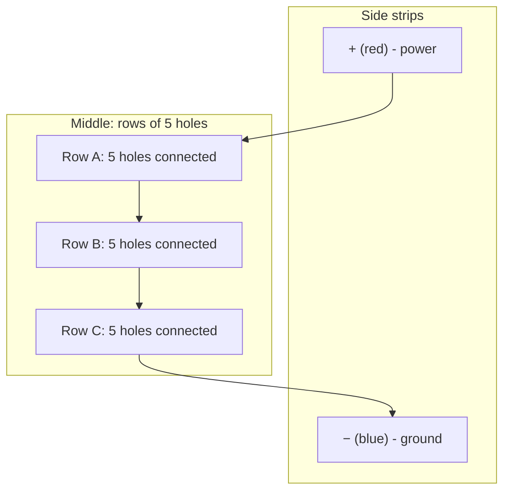
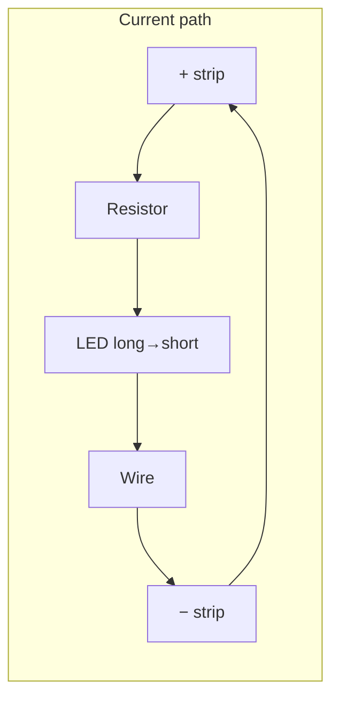

# Chapter 7: Breadboard & Circuit Building

**Part 1: Electronics & IoT | Grade 6**

---

## What Is a Breadboard?

**Figure 7.1 – Breadboard layout (Mermaid):** Power strips on sides; rows of 5 connected in the middle.

A **breadboard** is a plastic board with many small holes in it. Inside, the holes are connected by metal strips so that when you push a wire or a component leg into a hole, it makes electrical contact with other holes on the same strip. We use breadboards to build **temporary circuits** **without soldering**. You can plug and unplug parts, change connections, and try different ideas quickly. Once the circuit works, we can later solder it onto a permanent board if we want. The name “breadboard” comes from the old days when people sometimes used a wooden board (like a bread-cutting board) to hold their circuits.

| Feature | Why it is useful |
|---------|-------------------|
| **No soldering** | Easy to change parts and wires; safe for beginners |
| **Reusable** | Same breadboard can be used for many projects |
| **Quick** | Build and test in minutes |
| **Visible** | You can see all connections and learn how circuits look |

**Real-life link:** In school labs and at home, students use breadboards to build LED circuits, buzzers, and small sensors. Engineers use them to test ideas before making a final product.

---

## How a Breadboard Is Organised

A typical breadboard has:

- **Rows of holes** in the middle: usually rows of 5 holes connected together in a group (like a short rail). So any wire or leg in the same group of 5 is connected.
- **Long vertical strips** on the sides (often with **+** and **−** marks): these run along the length and are used for **power** (positive) and **ground** (negative). All holes in the same “+” strip are connected; all in the same “−” strip are connected.

**Important:** On some breadboards, the **+** and **−** strips are **split in the middle**. So the left half of the + strip is one connection, and the right half is another. Always check with a multimeter in continuity mode if you are not sure.

| Area | Connection |
|------|------------|
| **Middle rows** | Each row of 5 holes is one group (all connected) |
| **+ strip (red)** | One long connection for positive (e.g. battery +) |
| **− strip (blue/black)** | One long connection for negative (e.g. battery −) |

---

## Building a Simple LED Circuit on a Breadboard

A simple circuit: **Battery → Resistor → LED → back to battery.**

**Figure 7.2 – LED circuit on breadboard (Mermaid):** Current path from + strip to − strip.

1. **Place the battery:** Connect battery positive to one hole in the **+** strip and negative to a hole in the **−** strip (or use a battery holder and connect its wires to the strips).
2. **Place the resistor:** One leg in a hole connected to the + strip (or in a row that you will connect to +). The other leg in a hole in a **middle row** (Row A).
3. **Place the LED:** **Long leg (positive)** in the same row as the resistor’s second leg (Row A), or in a row connected to it. **Short leg (negative)** in another row (Row B).
4. **Complete the path:** Use a jumper wire from Row B to the **−** strip.

Now current flows: + strip → resistor → LED (long to short) → wire → − strip → battery. The LED should glow (if the battery voltage and resistor value are correct).

---

## LED Polarity

An LED has two legs. One is **longer**, one **shorter**. They must be connected the right way:

| Leg | Name | Connect to |
|-----|------|------------|
| **Long leg** | Anode (positive) | Higher voltage / positive side / through resistor to + |
| **Short leg** | Cathode (negative) | Lower voltage / negative / ground |

If you connect the LED **backwards** (short to +, long to −), it usually **will not glow** and no harm is done in a low-voltage circuit. But in some circuits, reverse connection can stress the LED. So always check: **long = positive, short = negative.**

**Memory tip:** Long = “plus” (positive). Or: the **flat side** of the LED case is often near the **negative** (short) leg.

---

## Common Mistakes on a Breadboard

| Mistake | What happens | What to do |
|---------|----------------|-----------|
| **LED in reverse** | LED does not glow | Swap the legs: long to +, short to − |
| **Wrong row or column** | Parts are not connected where you think | Check which holes are in the same group; use continuity mode on multimeter |
| **Loose wires** | Intermittent connection; circuit works sometimes | Push wires and legs firmly into the holes; ensure good contact |
| **Forgetting the resistor** | LED may burn out | Always use a resistor in series with the LED |
| **Using the wrong strip** | Power not where you expect | Check + and − strips; check if strips are split in the middle |
| **Short circuit** | Wire from + directly to − without a load; can heat battery | Never connect + to − with only a wire; always have a component (e.g. resistor, LED) in the path |

**Real-life example:** If the LED does not glow, first check: (1) Is the battery good? (2) Is the LED the right way (long leg to +)? (3) Is the resistor in place? (4) Are all wires and legs firmly in the right holes?

---

## A Little History

- **Breadboarding** became popular when electronics moved from heavy, wired panels to smaller circuits. Solderless breadboards with spring clips were developed in the 1960s and 1970s (e.g. by companies like AP Products and others), making it easy for students and engineers to prototype without soldering.

---

## One Level Higher: Kirchhoff’s Voltage Law (KVL)

When we have a simple loop (e.g. battery + resistor + LED), the **sum of voltages across each part** in the loop equals the **voltage of the battery**. So: Battery voltage = Voltage across resistor + Voltage across LED. This is a simplified idea from **Kirchhoff’s Voltage Law**: around any closed loop, the sum of voltage rises (e.g. from the battery) equals the sum of voltage drops (across resistor and LED). It helps us understand why the LED gets only part of the battery voltage and the rest is “dropped” across the resistor.

| In a simple loop | Idea |
|------------------|------|
| Battery (e.g. 9 V) | Provides the “push” |
| Resistor | “Uses” some voltage (e.g. 7 V) → limits current |
| LED | “Uses” the rest (e.g. 2 V) → glows safely |

---

## Key Points to Remember

- A **breadboard** is for **temporary circuits without soldering**; holes are connected by metal strips inside.
- **Rows of 5** in the middle are one group; **+** and **−** strips on the sides are for power and ground.
- **LED polarity:** Long leg = positive (anode), Short leg = negative (cathode).
- **Common mistakes:** LED reversed, wrong row (no connection), loose wires, no resistor, short circuit.
- **Kirchhoff’s Voltage Law** (simple form): In a loop, battery voltage = sum of voltages across components.

---

## Multiple Choice Questions

1. A breadboard is used to  
   (a) cut wires  
   (b) build temporary circuits without soldering  
   (c) store batteries  
   (d) measure voltage only  

2. In a typical breadboard, a row of 5 holes in the middle is  
   (a) not connected  
   (b) connected together (same group)  
   (c) only for the battery  
   (d) only for LEDs  

3. The long leg of an LED is the  
   (a) negative (cathode)  
   (b) positive (anode)  
   (c) neutral  
   (d) ground  

4. The short leg of an LED is the  
   (a) positive  
   (b) negative (cathode)  
   (c) both  
   (d) neither  

5. If the LED does not glow, one possible reason is  
   (a) the battery is too strong  
   (b) the LED is connected in reverse  
   (c) the resistor is too small  
   (d) the breadboard is too big  

6. The red strip on a breadboard is usually for  
   (a) ground  
   (b) positive (power)  
   (c) resistance  
   (d) current only  

7. Loose wires on a breadboard can cause  
   (a) more voltage  
   (b) intermittent connection; circuit may work sometimes and not others  
   (c) no effect  
   (d) the LED to glow brighter  

8. Connecting the battery + directly to − with only a wire (no resistor or LED) is  
   (a) a good way to test the battery  
   (b) a short circuit; can be dangerous or damage the battery  
   (c) needed for the LED  
   (d) correct for all circuits  

9. We push wires and component legs into the holes to  
   (a) store them  
   (b) make electrical contact with the metal strips inside  
   (c) measure current  
   (d) cut them  

10. The name “breadboard” came from  
    (a) using bread to hold circuits  
    (b) old practice of using a wooden board to hold circuits  
    (c) the colour of the board  
    (d) the shape of the holes  

11. On some breadboards, the + and − strips are  
    (a) always one continuous strip  
    (b) sometimes split in the middle (left and right separate)  
    (c) never used  
    (d) only for LEDs  

12. To complete an LED circuit on a breadboard we need  
    (a) only an LED  
    (b) battery, resistor, LED, and wires (or strips)  
    (c) only a battery  
    (d) only wires  

13. Kirchhoff’s Voltage Law (simple idea) says that in a closed loop  
    (a) current is zero  
    (b) the sum of voltage drops equals the battery voltage (in a simple loop)  
    (c) resistance is constant  
    (d) the LED always burns  

14. The flat side of the LED case is usually near the  
    (a) long leg  
    (b) short leg (negative)  
    (c) middle  
    (d) top  

15. A “short circuit” means  
    (a) the wires are too short  
    (b) current takes a path with almost no resistance (e.g. wire from + to −); can be dangerous  
    (c) the circuit is open  
    (d) the resistor is missing from the LED  

16. Solderless breadboards became popular around  
    (a) 1800s  
    (b) 1960s–1970s  
    (c) 2000 only  
    (d) 2020 only  

17. We use a resistor in series with the LED on a breadboard to  
    (a) increase voltage  
    (b) limit current and protect the LED  
    (c) make the circuit open  
    (d) store charge  

18. Rows in the middle of a breadboard are often in groups of  
    (a) 2 holes  
    (b) 5 holes  
    (c) 10 holes  
    (d) 20 holes  

19. To check if two holes are connected we can use  
    (a) only a battery  
    (b) a multimeter in continuity mode  
    (c) only an LED  
    (d) only a resistor  

20. Anode is the __________ terminal of an LED.  
    (a) negative  
    (b) positive  
    (c) neutral  
    (d) ground  

21. Cathode is the __________ terminal of an LED.  
    (a) positive  
    (b) negative  
    (c) both  
    (d) neither  

22. Voltage “drop” across a resistor means  
    (a) the resistor is broken  
    (b) some voltage is used across the resistor (part of the battery voltage)  
    (c) current is zero  
    (d) the LED is off  

23. Prototyping means  
    (a) selling the circuit  
    (b) building and testing a circuit (e.g. on a breadboard) before making the final product  
    (c) only drawing the circuit  
    (d) only measuring resistance  

24. Jumper wires are used to  
    (a) cut the board  
    (b) connect different rows or strips on the breadboard  
    (c) only hold the battery  
    (d) only measure current  

25. After building on a breadboard, we can  
    (a) never reuse the parts  
    (b) reuse the breadboard and parts for another circuit  
    (c) only use it once  
    (d) only measure voltage  

---

**Answers:** 1-b, 2-b, 3-b, 4-b, 5-b, 6-b, 7-b, 8-b, 9-b, 10-b, 11-b, 12-b, 13-b, 14-b, 15-b, 16-b, 17-b, 18-b, 19-b, 20-b, 21-b, 22-b, 23-b, 24-b, 25-b.
