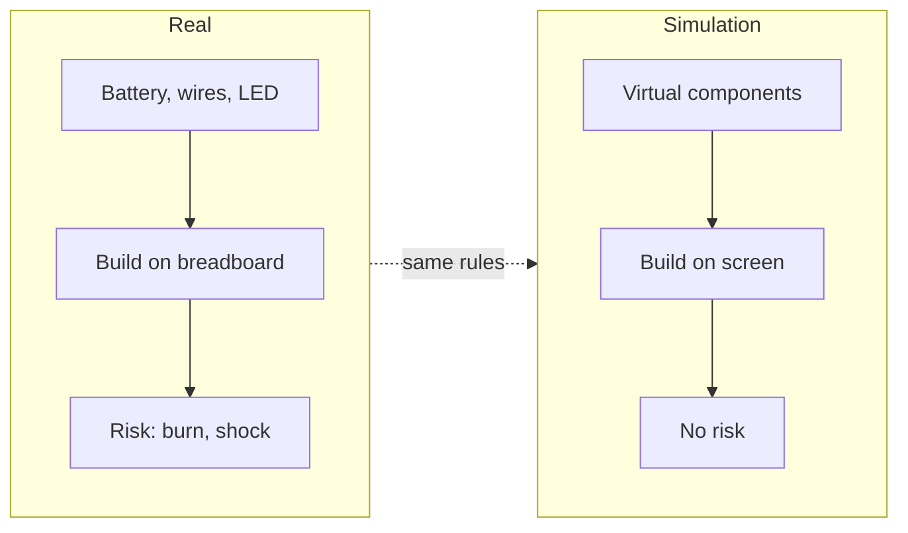
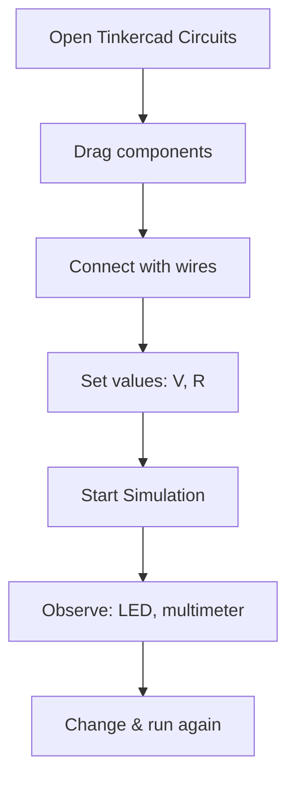

# Chapter 8: Simulating Circuits – Tinkercad

**Part 1: Electronics & IoT | Grade 6**

---

## What Is Simulation?

**Figure 8.1 – Real circuit vs simulation (Mermaid):** Same logic; simulation is virtual and safe.

**Simulation** means testing something on a **computer** instead of in the real world. For circuits, we build the circuit on the screen using virtual batteries, wires, resistors, LEDs, and other parts. The computer **calculates** how current would flow and shows us the result—for example, whether the LED would glow, how bright it would be, or what the voltage and current are. So we can **try ideas without using real parts** and without risk of burning components, short circuits, or electric shock. Simulation is like a “practice ground” for circuits.

| Term | Meaning |
|------|--------|
| **Simulation** | Running a model of a circuit (or system) on a computer to see how it behaves |
| **Virtual** | Not real; represented on screen |
| **Real circuit** | Built with physical parts (breadboard, wires, battery) |

**Real-life link:** Pilots train in flight simulators before flying a real plane. In the same way, we can “fly” our circuits in Tinkercad before building them with real wires and batteries.

---

## Why Use Tinkercad?

**Tinkercad** is a free, web-based tool from Autodesk. It has a section for **Circuits** where you can drag and drop components, connect them with wires, and run a simulation. It is used in many schools and by beginners around the world.

| Benefit | Explanation |
|---------|--------------|
| **No risk** | No real electricity; no chance of burning an LED, short circuit, or shock |
| **No cost for parts** | You do not need to buy batteries, LEDs, or resistors to try many circuits |
| **Easy to test** | Change a resistor value or add a component and see the result in seconds |
| **Learn before building** | Understand how circuits work, then build the same circuit on a real breadboard |
| **Available anywhere** | Works in a web browser; you can use it at school or home with internet |
| **Share and remix** | You can share your design or use designs shared by others (with permission) |

**Real-life examples:**

- **Before a science fair:** Build and test your project in Tinkercad, then build it for real.
- **Learning Ohm’s Law:** Change the resistor value and see how the LED brightness or current changes.
- **Trying different layouts:** See what happens with two LEDs in series vs in parallel without using real parts.

---

## What Can You Do in Tinkercad Circuits?

You can add:

- **Power:** Batteries (e.g. 9 V, 3 V), DC supply
- **Components:** Resistors, LEDs, bulbs, switches, buzzers, motors (simple)
- **Measuring:** Multimeter (voltage, current, resistance) in the simulation
- **Microcontrollers:** Arduino (simple programs) for interactive circuits

You **connect** them by clicking on terminals and drawing wires. Then you press **Start Simulation**. The program shows current flow (often with small moving dots), glowing LEDs, and you can open the multimeter to see voltage and current. When you are done, you press **Stop Simulation**.

**Flowchart 8.1 – Using Tinkercad Circuits (Mermaid):** From design to result.

| Step | What you do |
|------|-------------|
| 1 | Open Tinkercad Circuits in your browser (free account may be needed) |
| 2 | Drag components from the panel onto the work area |
| 3 | Connect them with wires (click one terminal, then the other) |
| 4 | Set values (e.g. resistor in Ω, battery voltage) if needed |
| 5 | Start Simulation and observe (LEDs glow, multimeter shows values) |
| 6 | Change something (e.g. resistor value) and run again to compare |

---

## Simulation vs Real Circuit

Simulation is very useful but not exactly the same as reality. In real circuits, wires have tiny resistance, batteries get weak over time, and parts can be slightly different from the “ideal” values. So we use simulation to **learn and test ideas**, and then we **build the real circuit** to see it work with our own hands and to notice any small differences.

| Simulation | Real circuit |
|------------|--------------|
| Safe; no risk of damage or shock | Need to follow safety rules |
| Instant change of values | Need to change physical parts |
| Ideal components (exact values) | Real parts have tolerances |
| Good for learning and trying ideas | Good for final project and exhibition |

---

## A Little History

- **Circuit simulation** on computers started in universities and companies in the 1960s and 1970s (e.g. SPICE). Engineers could test complex circuits before building them.
- **Tinkercad** was launched in 2011 and later acquired by **Autodesk**. The Circuits section added electronics simulation so that students and hobbyists could learn without needing expensive lab equipment.

---

## One Level Higher: What the Computer Actually Does

When you press “Start Simulation,” the program builds **equations** from your circuit (using laws like Ohm’s Law and Kirchhoff’s laws). It then **solves** these equations to find current and voltage everywhere. So the “simulation” is really **math** done very fast. For direct current (DC), it often solves once; for circuits that change with time (e.g. blinking LED with a timer), it solves step by step over time. Understanding that simulation = solving circuit equations helps us see why the values on the virtual multimeter make sense (e.g. V = I × R across a resistor).

| Idea | Short explanation |
|------|-------------------|
| **Circuit equations** | From Ohm’s Law and Kirchhoff’s laws we write equations for voltages and currents |
| **Solver** | The computer finds the numbers (voltages, currents) that satisfy all equations |
| **Result** | We see those numbers on the multimeter and as LED brightness in the simulation |

---

## Key Points to Remember

- **Simulation** = testing a circuit on a computer instead of with real parts.
- **Tinkercad Circuits** is a free, browser-based tool to build and simulate circuits.
- Benefits: **no risk**, **no cost for parts**, **easy to test**, **learn before building**.
- Steps: add components → connect with wires → set values → run simulation → observe and change.
- Simulation uses **math** (circuit equations) to compute voltages and currents; real circuits may differ slightly from the ideal result.

---

## Multiple Choice Questions

1. Simulation means  
   (a) building only real circuits  
   (b) testing a circuit on a computer (virtual)  
   (c) measuring with a real multimeter only  
   (d) selling circuits  

2. Why is simulation useful?  
   (a) It costs more  
   (b) No risk; we can try circuits without burning parts or getting a shock  
   (c) It is slower than real circuits  
   (d) It does not use any laws  

3. Tinkercad is  
   (a) only for 3D design  
   (b) a free web-based tool that includes circuit simulation  
   (c) a type of battery  
   (d) a real breadboard  

4. In Tinkercad Circuits we can add  
   (a) only wires  
   (b) batteries, resistors, LEDs, multimeter, and more  
   (c) only resistors  
   (d) only LEDs  

5. To see current and voltage in Tinkercad we can use  
   (a) only a battery  
   (b) the virtual multimeter in the simulation  
   (c) only a resistor  
   (d) only wires  

6. “Start Simulation” in Tinkercad  
   (a) builds a real circuit  
   (b) runs the virtual circuit and shows how it behaves  
   (c) deletes the circuit  
   (d) only saves the design  

7. Simulation is like a __________ for circuits.  
   (a) final exam  
   (b) practice ground  
   (c) real lab only  
   (d) battery  

8. Who owns Tinkercad?  
   (a) A school  
   (b) Autodesk  
   (c) A battery company  
   (d) A wire company  

9. We should use simulation to  
   (a) replace all real experiments  
   (b) learn and test ideas, then build the real circuit to confirm  
   (c) never build real circuits  
   (d) only measure resistance  

10. Circuit simulation on computers started to become common around  
    (a) 1700s  
    (b) 1960s–1970s (e.g. SPICE)  
    (c) 2000 only  
    (d) 2020 only  

11. In simulation, the computer  
   (a) guesses the result  
   (b) solves circuit equations (e.g. Ohm’s Law, Kirchhoff’s laws) to find voltages and currents  
   (c) does not use any math  
   (d) only shows colours  

12. Real circuits may differ slightly from simulation because  
   (a) simulation is always wrong  
   (b) real parts have tolerances and real wires have tiny resistance  
   (c) real circuits do not follow Ohm’s Law  
   (d) simulation uses AC only  

13. Tinkercad Circuits works  
   (a) only on one type of computer  
   (b) in a web browser (with internet)  
   (c) only offline  
   (d) only for teachers  

14. After testing in Tinkercad we can  
   (a) only keep it on the computer  
   (b) build the same circuit with real parts on a breadboard  
   (c) never build it  
   (d) only print the diagram  

15. “Virtual” means  
   (a) very old  
   (b) not real; on screen / in software  
   (c) very fast  
   (d) very large  

16. SPICE is related to  
   (a) cooking  
   (b) early circuit simulation software  
   (c) a type of wire  
   (d) a battery  

17. In Tinkercad we connect components by  
   (a) soldering  
   (b) drawing wires between terminals (click to click)  
   (c) only placing them side by side  
   (d) using a hammer  

18. Changing a resistor value in simulation is  
   (a) impossible  
   (b) done by editing the component and entering a new value; then run simulation again  
   (c) only possible in real circuits  
   (d) only for experts  

19. Simulation helps us understand  
   (a) only 3D design  
   (b) how circuits behave (current, voltage, which parts glow)  
   (c) only history  
   (d) only sports  

20. Tinkercad was launched around  
   (a) 1950  
   (b) 2011  
   (c) 2000  
   (d) 1800  

21. The equations used in circuit simulation include  
   (a) only addition  
   (b) Ohm’s Law and Kirchhoff’s laws  
   (c) only multiplication  
   (d) no physics  

22. “No risk” in simulation means  
   (a) no chance of electric shock or burning parts (no real electricity)  
   (b) the circuit always works  
   (c) we never make mistakes  
   (d) the computer never fails  

23. We can use Tinkercad to learn  
   (a) only drawing  
   (b) circuits, then build them for real  
   (c) only history  
   (d) only languages  

24. In Tinkercad, “Stop Simulation”  
   (a) deletes the circuit  
   (b) stops the running simulation  
   (c) builds a real circuit  
   (d) only saves the file  

25. Autodesk is known for  
   (a) making batteries  
   (b) software for design (e.g. Tinkercad, AutoCAD)  
   (c) making wires  
   (d) making breadboards  

---

**Answers:** 1-b, 2-b, 3-b, 4-b, 5-b, 6-b, 7-b, 8-b, 9-b, 10-b, 11-b, 12-b, 13-b, 14-b, 15-b, 16-b, 17-b, 18-b, 19-b, 20-b, 21-b, 22-a, 23-b, 24-b, 25-b.
