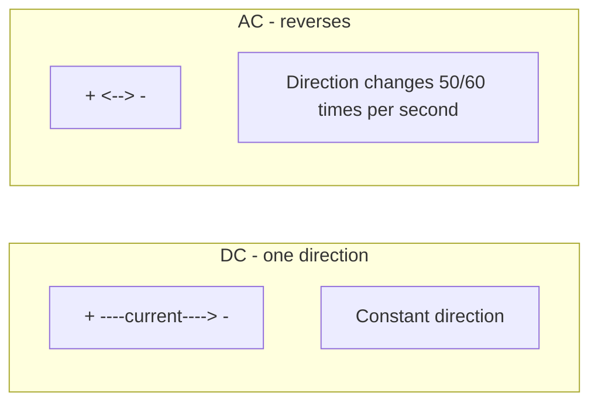
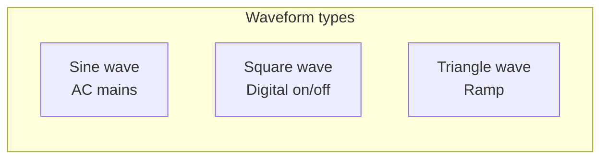

# Chapter 9: AC vs DC & Electrical Waveforms

**Part 1: Electronics & IoT | Grade 6**

---

## What Is DC?

**Figure 9.1 – DC vs AC (Mermaid):** Direction of current over time.

**DC** stands for **Direct Current**. In DC, the electric current flows in **one direction** only—like water flowing in one direction through a pipe. The voltage (push) also stays in one direction: positive stays positive and negative stays negative. Batteries, cells, and most phone chargers (at the output) give **DC**. That is why we talk about the “positive” and “negative” terminals of a battery; they do not swap.

| Feature | DC (Direct Current) |
|---------|----------------------|
| **Direction of current** | One direction only |
| **Voltage** | Constant direction (e.g. +9 V and − always the same) |
| **Common sources** | Battery, cell, solar cell, DC power supply, USB (5 V DC) |
| **Use** | Phones, laptops, LEDs, small motors, most electronic circuits |

**Real-life examples:** A torch runs on DC from the battery. A car battery gives 12 V DC. The USB port on a computer or charger gives 5 V DC.

---

## What Is AC?

**AC** stands for **Alternating Current**. In AC, the current **changes direction again and again**. So the voltage also reverses: what was positive becomes negative, then positive again, and so on. The **mains supply** in our homes is AC—in India it is usually **230 V AC** at **50 Hz**, meaning the voltage and current reverse direction **50 times per second**. AC is used for long-distance power transmission and for many home appliances (through proper design). We must **never** touch live AC wires—it is dangerous.

| Feature | AC (Alternating Current) |
|---------|---------------------------|
| **Direction of current** | Reverses periodically |
| **Voltage** | Switches between + and − (e.g. 230 V then −230 V, 50 times per second in India) |
| **Common source** | Mains supply (wall socket), generator |
| **Use** | Home lighting, fans, refrigerators, industry; converted to DC for phones and laptops via adapters |

**Real-life example:** When you plug a phone charger into the wall, the wall gives AC. Inside the charger, circuits **convert** AC to DC so the phone battery gets the right kind of current.

---

## Frequency

**Frequency** means **how many times something repeats per second**. For AC, we ask: how many times does the current (or voltage) complete one full “cycle” (e.g. from zero → positive → back to zero → negative → back to zero) in one second? The unit is **Hertz (Hz)**. 1 Hz = 1 cycle per second.

| Idea | Explanation |
|------|--------------|
| **Frequency** | Number of cycles per second |
| **Unit** | Hertz (Hz) |
| **50 Hz (India)** | Current/voltage completes 50 full cycles every second |
| **If frequency increases** | More cycles per second (e.g. 60 Hz in some countries = 60 cycles per second) |

**Real-life link:** In India, the hum of a transformer or some lights is related to 50 Hz. In countries that use 60 Hz, the same things run at 60 cycles per second.

---

## Waveforms

**Figure 9.2 – Common waveforms (Mermaid):** Sine (AC), square, triangle.

We can draw **voltage or current over time** as a **waveform** (a graph). The shape of this graph tells us what kind of supply or signal we have.

| Waveform | Description | Where we see it |
|----------|-------------|------------------|
| **Sine wave** | Smooth rise and fall; like a wave on water | AC mains supply (ideal); sound; radio |
| **Square wave** | Flat on top, flat on bottom; instant jump between high and low | Digital signals; on/off switching; some timers |
| **Triangle wave** | Straight rise, then straight fall | Some test equipment; simple ramp signals |

**Sine wave** is the “pure” AC shape. **Square wave** is like switching a bulb fully on and fully off repeatedly. **Triangle wave** rises and falls in a straight line.

---

## Function Generator

A **function generator** is a device (or software) that **produces** different types of waveforms. We can choose:

- **Sine wave**
- **Square wave**
- **Triangle wave**

and set the **frequency** and **amplitude** (height). Engineers and students use it to test circuits—for example, to see how an amplifier or filter responds to different signals. In a lab, it is a small box with knobs or a screen; on a computer, we can use software that acts like a function generator.

| Output | Use |
|--------|-----|
| **Sine** | Simulate AC; test audio and radio circuits |
| **Square** | Test digital circuits; timing; on/off behaviour |
| **Triangle** | Test linearity; ramp signals |

---

## A Little History

- **Thomas Edison** favoured **DC** for early power distribution; his systems used DC.
- **Nikola Tesla** and **George Westinghouse** promoted **AC** because it could be sent over long distances with less loss (using transformers to step voltage up and down). The “War of the Currents” in the late 1800s led to AC being used for mains supply in most of the world.
- **Heinrich Hertz** (1857–1894) did pioneering work on electromagnetic waves; the unit of frequency is named after him.

---

## One Level Higher: Peak Voltage vs RMS (For AC)

For AC, the voltage is not constant. So we need a way to say “how strong” the AC is. Two common ideas:

**Peak voltage:** The **maximum** value the voltage reaches in one cycle (the top of the sine wave). For a 230 V AC mains (in India), the **peak** is higher than 230 V—about 230 × √2 ≈ 325 V. So the wave goes from about +325 V down to −325 V and back.

**RMS (Root Mean Square):** A kind of “average” that tells us what **equivalent DC voltage** would give the same heating effect in a resistor. When we say “230 V AC,” we usually mean **230 V RMS**. So 230 V AC (RMS) can do similar work as 230 V DC in terms of power in a resistor. This is why we can compare “230 V” on the socket to a “230 V” DC supply in power calculations.

| Term | Short meaning |
|------|----------------|
| **Peak** | Maximum value in one cycle (e.g. peak of sine wave) |
| **RMS** | “Equivalent” constant value for power comparison; 230 V AC means 230 V RMS in India |

---

## Key Points to Remember

- **DC** = current in one direction; e.g. battery, USB.
- **AC** = current that reverses direction; e.g. mains supply (India: 230 V, 50 Hz).
- **Frequency** = cycles per second; unit **Hertz (Hz)**. Higher frequency = more cycles per second.
- **Waveforms:** Sine (AC supply), square (digital/on-off), triangle (ramp).
- **Function generator** produces sine, square, and triangle waves at a set frequency.
- **Peak** = maximum voltage in a cycle; **RMS** = equivalent DC-like value for power (e.g. 230 V AC = 230 V RMS).

---

## Multiple Choice Questions

1. DC stands for  
   (a) Double Current  
   (b) Direct Current  
   (c) Digital Current  
   (d) Alternating Current  

2. In DC, current flows  
   (a) in both directions  
   (b) in one direction only  
   (c) only in wires  
   (d) only in batteries  

3. AC stands for  
   (a) Alternating Current  
   (b) Always Closed  
   (c) Average Current  
   (d) Direct Current  

4. In AC, current  
   (a) flows in one direction only  
   (b) changes direction again and again  
   (c) is always zero  
   (d) is only in batteries  

5. Frequency is measured in  
   (a) Volts  
   (b) Amperes  
   (c) Hertz  
   (d) Ohms  

6. 50 Hz means  
   (a) 50 Volts  
   (b) 50 cycles per second  
   (c) 50 Amperes  
   (d) 50 Ohms  

7. If frequency increases, the number of cycles per second  
   (a) decreases  
   (b) increases  
   (c) stays the same  
   (d) becomes zero  

8. A sine wave is typically associated with  
   (a) only DC  
   (b) AC supply (ideal shape)  
   (c) only batteries  
   (d) only resistors  

9. A square wave looks like  
   (a) a smooth wave  
   (b) flat high, flat low; instant jumps (on/off style)  
   (c) a straight line  
   (d) a circle  

10. A function generator can produce  
    (a) only sine waves  
    (b) sine, square, and triangle waves  
    (c) only DC  
    (d) only current  

11. Home mains supply in India is usually  
   (a) 12 V DC  
   (b) 230 V AC, 50 Hz  
   (c) 5 V DC  
   (d) 9 V DC  

12. A battery gives  
   (a) AC  
   (b) DC  
   (c) both  
   (d) neither  

13. Who promoted AC for long-distance power transmission?  
   (a) Only Edison  
   (b) Tesla and Westinghouse (among others)  
   (c) Only Ohm  
   (d) Only Volta  

14. The unit “Hertz” is named after  
   (a) Ohm  
   (b) Hertz (scientist who worked on waves)  
   (c) Edison  
   (d) Tesla  

15. RMS voltage is used to  
   (a) measure only DC  
   (b) describe “equivalent” strength of AC (e.g. 230 V AC = 230 V RMS)  
   (c) measure only frequency  
   (d) measure only resistance  

16. Peak voltage of a sine wave is  
   (a) always equal to RMS  
   (b) the maximum value in one cycle (higher than RMS for sine)  
   (c) always zero  
   (d) only for DC  

17. A triangle wave has  
   (a) only curves  
   (b) straight rise and straight fall  
   (c) only flat parts  
   (d) no frequency  

18. Phone charger converts  
   (a) DC to AC  
   (b) AC from wall to DC for the phone  
   (c) only stores charge  
   (d) only measures voltage  

19. 60 Hz is used in some countries (e.g. USA) for mains; it means  
   (a) 60 Volts  
   (b) 60 cycles per second  
   (c) 60 Amperes  
   (d) 60 Ohms  

20. “War of the Currents” was about  
   (a) only batteries  
   (b) AC vs DC for power distribution (Edison vs Tesla/Westinghouse)  
   (c) only wires  
   (d) only light bulbs  

21. For a 230 V RMS sine wave, the peak is approximately  
   (a) 230 V  
   (b) 230 × √2 ≈ 325 V  
   (c) 0 V  
   (d) 115 V  

22. Transformers are used with  
   (a) only DC  
   (b) AC (to step voltage up or down)  
   (c) only batteries  
   (d) only LEDs  

23. Square waves are common in  
   (a) only sine circuits  
   (b) digital and switching circuits  
   (c) only AC mains  
   (d) only batteries  

24. One cycle of AC means  
   (a) one second  
   (b) one complete pattern (e.g. zero → positive → zero → negative → zero)  
   (c) one volt  
   (d) one ampere  

25. We must never touch live AC mains because  
   (a) it is DC  
   (b) it is dangerous (risk of severe shock or death)  
   (c) it is low voltage  
   (d) it has no frequency  

---

**Answers:** 1-b, 2-b, 3-a, 4-b, 5-c, 6-b, 7-b, 8-b, 9-b, 10-b, 11-b, 12-b, 13-b, 14-b, 15-b, 16-b, 17-b, 18-b, 19-b, 20-b, 21-b, 22-b, 23-b, 24-b, 25-b.
