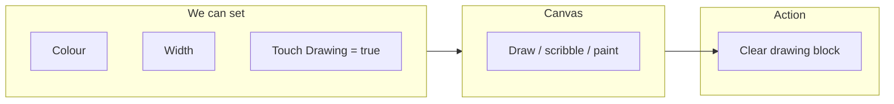

# Chapter 13: Canvas & Drawing Apps

**Part 2: Computational Thinking | Grade 6**

---

## What Is a Canvas?

**Figure 13.1 – Canvas in a drawing app (Mermaid):** User draws on canvas; we control colour, width, clear.

A **canvas** is a **space** on the screen where the user can **draw**, **scribble**, or **paint** using a finger (on touch devices) or a mouse (on computers). In app builders like Thunkable, the Canvas is a component you place on the screen; it has a width and height and can detect touches and drags. So a canvas is the “drawing area” inside your app—like a sheet of paper or a whiteboard. Everything the user draws appears on that canvas until we clear it or draw something new.

| Term | Meaning |
|------|---------|
| **Canvas** | A component that acts as a drawing area (user can draw on it) |
| **Drawing area** | The region where strokes (lines, scribbles) appear |
| **Touch / drag** | User touches and moves finger (or mouse) to draw a line or path |

**Real-life link:** Drawing apps (e.g. for kids or for notes) use a canvas. So do signature pads and simple paint tools. The canvas is where all the drawing happens.

---

## What Changes While Drawing?

When the user moves their finger (or mouse) on the canvas, we can change **how** the drawing looks. The app can control:

| What we can change | Meaning |
|--------------------|---------|
| **Drawing colour** | The colour of the line (e.g. red, blue, black). |
| **Drawing width** | How thick the line is (thin like a pen or thick like a brush). |
| **Drawing path** | The points that form the line (where the finger moved). The path is the “trail” of the stroke. |

So we can make a thin red pen, a thick blue brush, or a medium black line by setting **colour** and **width**, and the **path** is built from the touch/drag positions. In block-based apps we often have blocks like “set Canvas paint colour to” and “set Canvas line width to,” and the canvas automatically draws the path as the user drags.

**Real-life example:** In a drawing app, when you choose “brush” and “red,” every stroke you make is red. When you choose “thick,” the line is thick. The canvas remembers the path (all the points) so the drawing stays on the screen.

---

## Making Drawing Work

For the user to actually **draw** on the canvas, we must **enable** drawing. In Thunkable (and similar tools), there is usually a property like **Touch Drawing** or **Draw on touch**. We need to set this to **true** (or the equivalent) so that when the user touches and drags, the app draws a line. If it is **false**, the canvas might only detect touches but not draw, or might not respond for drawing at all.

| Step | What we do |
|------|------------|
| 1 | Add a Canvas component to the screen (designer). |
| 2 | Set **Touch Drawing** (or similar) to **true** so drawing is enabled. |
| 3 | Optionally set default paint colour and line width. |
| 4 | (Optional) Use “when Canvas dragged” or “when Canvas touched” to change colour or width while drawing (e.g. with a colour picker or slider). |

**Real-life link:** Like turning on “drawing mode” on a whiteboard. Until it’s on, touching the board might not leave a mark; once it’s on, every touch or drag draws.

---

## Clearing the Canvas

After drawing, we often want to **clear** the canvas so the user can start again. There is usually a block like **Clear canvas** or **Clear drawing** that removes all the strokes from the canvas. We typically call this when the user taps a “Clear” or “Reset” button. So:

- Add a button (e.g. “Clear”).
- In “when Clear button Click,” use the block **Clear canvas** (or “Clear drawing” for that canvas).

After that, the canvas is blank and ready for new drawing.

| Action | Result |
|--------|--------|
| **Clear canvas** | All drawn strokes are removed; canvas is blank |
| **When to use** | When user taps “Clear” or “New drawing” |

---

## A Little History

- **Bitmap and vector graphics** on computers date back to the 1960s and 1970s (e.g. Sketchpad by Ivan Sutherland). Drawing on screen became common with **paint programs** (e.g. MacPaint, Microsoft Paint) and later **touch screens** on phones and tablets.
- **Canvas** in web and app development (e.g. HTML5 Canvas, and similar in app builders) lets programs draw lines and shapes from code or from user input. Today almost every drawing or whiteboard app uses a canvas-like area and touch/drag events.

---

## One Level Higher: Coordinates and Pixels

The canvas is a **grid of pixels**. Each point on the canvas has **coordinates**: usually **x** (horizontal position) and **y** (vertical position). Often x = 0 is the left edge and y = 0 is the top edge; x increases to the right and y increases downward. When the user drags, the app gets a **sequence of (x, y) points**—the “path.” Drawing is done by drawing short line segments from one point to the next. So the “drawing path” is really a list of coordinates. Understanding coordinates helps when we want to do more (e.g. draw shapes from code, or save the drawing as a list of points). For a simple drawing app we might not need to use x and y directly—the canvas component can handle the path—but knowing that “path = list of (x, y) points” is the higher idea.

| Idea | Meaning |
|------|---------|
| **Pixel** | One small dot on the screen |
| **Coordinates (x, y)** | Position: x = horizontal, y = vertical (often from top-left) |
| **Path** | Sequence of (x, y) points that form the drawn line |

---

## Key Points to Remember

- A **canvas** is a **drawing area** where users can draw, scribble, or paint with finger or mouse.
- We can change **drawing colour**, **drawing width**, and the **path** (the trail of the stroke) while drawing.
- Set **Touch Drawing** (or similar) to **true** to allow drawing on the canvas.
- Use the **Clear canvas** (or Clear drawing) block to erase all strokes, often when the user taps a “Clear” button.
- The canvas is like a grid of **pixels**; drawing path is a sequence of **(x, y)** coordinates.

---

## Multiple Choice Questions

1. A canvas is  
   (a) only a button  
   (b) a space where users can draw, scribble, or paint  
   (c) only a label  
   (d) only a variable  

2. On the canvas we can change  
   (a) only the button colour  
   (b) drawing colour, drawing width, and the path  
   (c) only the screen size  
   (d) only the app name  

3. To allow drawing we must set  
   (a) only the label text  
   (b) Touch Drawing (or similar) to true  
   (c) only the variable to 0  
   (d) only the button to visible  

4. To clear all drawing we use  
   (a) only a new canvas  
   (b) the Clear canvas (or Clear drawing) block  
   (c) only a label  
   (d) only a variable  

5. Drawing path means  
   (a) only a single point  
   (b) the trail of points (line) the user drew  
   (c) only the colour  
   (d) only the width  

6. We usually clear the canvas when  
   (a) the app starts only  
   (b) the user taps a Clear or Reset button  
   (c) the user draws one line  
   (d) the screen opens  

7. Drawing width controls  
   (a) only the colour  
   (b) how thick the line is  
   (c) only the canvas size  
   (d) only the number of strokes  

8. Drawing colour controls  
   (a) only the canvas background  
   (b) the colour of the drawn line  
   (c) only the button  
   (d) only the label  

9. The user can draw with  
   (a) only the keyboard  
   (b) finger (touch) or mouse  
   (c) only voice  
   (d) only a button  

10. Canvas is a  
    (a) variable  
    (b) component we add to the screen (drawing area)  
    (c) only a block  
    (d) only an event  

11. Coordinates on a canvas are often  
   (a) only (0, 0)  
   (b) (x, y) where x is horizontal, y is vertical  
   (c) only colours  
   (d) only widths  

12. A pixel is  
   (a) a big area  
   (b) one small dot on the screen  
   (c) only a sound  
   (d) only a variable  

13. If Touch Drawing is false,  
   (a) the user can always draw  
   (b) drawing might not work (we need it true to draw)  
   (c) the canvas is always clear  
   (d) the canvas disappears  

14. Clear canvas removes  
   (a) only the last point  
   (b) all drawn strokes (the canvas becomes blank)  
   (c) only the colour  
   (d) only the width  

15. The “path” of a stroke is  
   (a) only one coordinate  
   (b) the sequence of points that form the line  
   (c) only the colour  
   (d) only the canvas size  

16. Paint programs (e.g. early computer paint) used  
   (a) only text  
   (b) a drawing/canvas-like area and pixels  
   (c) only buttons  
   (d) only variables  

17. We can use “when Canvas dragged” to  
   (a) only clear the canvas  
   (b) change colour or width while drawing, or record the path  
   (c) only set a variable once  
   (d) only show a label  

18. x = 0, y = 0 is often  
   (a) the centre  
   (b) the top-left corner of the canvas  
   (c) the bottom-right  
   (d) outside the canvas  

19. A “Clear” button often  
   (a) only adds more drawing  
   (b) runs the Clear canvas block when clicked  
   (c) only changes colour  
   (d) only sets width  

20. Drawing on a canvas is stored as  
   (a) only one number  
   (b) a set of strokes (paths), each path being points (e.g. x, y)  
   (c) only text  
   (d) only a variable  

21. Brush size in a drawing app is like  
   (a) only colour  
   (b) drawing width (thick or thin line)  
   (c) only the canvas size  
   (d) only the button  

22. Ivan Sutherland’s Sketchpad was an early  
   (a) battery  
   (b) computer drawing/graphics system  
   (c) only a game  
   (d) only a calculator  

23. HTML5 Canvas is used for  
   (a) only storing text  
   (b) drawing graphics and lines in web pages (and similar idea in apps)  
   (c) only buttons  
   (d) only variables  

24. When we “draw” we are really  
   (a) only changing one pixel  
   (b) drawing line segments between points (path) with a given colour and width  
   (c) only clearing  
   (d) only setting a variable  

25. A signature pad in an app uses  
   (a) only a label  
   (b) a canvas (user draws their signature)  
   (c) only a button  
   (d) only a slider  

---

**Answers:** 1-b, 2-b, 3-b, 4-b, 5-b, 6-b, 7-b, 8-b, 9-b, 10-b, 11-b, 12-b, 13-b, 14-b, 15-b, 16-b, 17-b, 18-b, 19-b, 20-b, 21-b, 22-b, 23-b, 24-b, 25-b.
