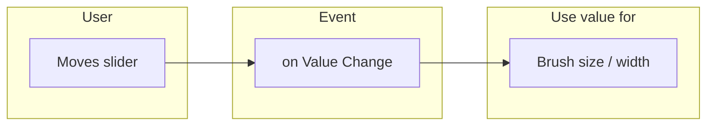

# Chapter 14: Sliders & Controls

**Part 2: Computational Thinking | Grade 6**

---

## What Is a Slider?

**Figure 14.1 – Slider and when it runs code (Mermaid):** User moves slider → value changes → on Value Change runs.

A **slider** is a **control** that lets the user **change a value by sliding**—usually by dragging a thumb or knob along a track. The value is often a number between a **minimum** and a **maximum** (e.g. 0 to 100). Sliders are used for things like volume, brightness, size, or speed when we want a **continuous** change rather than just on/off. In block-based apps (e.g. Thunkable), we add a Slider component to the screen; the user moves it, and we can read its value and use it in our blocks (e.g. set drawing width or volume).

| Term | Meaning |
|------|---------|
| **Slider** | A control: user drags to set a value (e.g. 0–100) |
| **Track** | The line or bar along which the thumb moves |
| **Thumb / Knob** | The part the user drags |
| **Value** | The number the slider represents (e.g. 0 to 100, or min to max) |

**Real-life examples:**

- **Volume control:** Slider to make sound louder or softer.
- **Brightness:** Slider on a phone or lamp to make the screen or light dimmer or brighter.
- **Brush size in a drawing app:** Slider to choose thin or thick lines.

---

## When Does a Slider Trigger?

When the user **moves** the slider (drags the thumb), the slider’s value **changes**. In the blocks editor we want to **run code** when that happens—for example, update the drawing width or a label that shows the current value. So we use an event like **when Slider value changes** (or “on Value Change”). Every time the user moves the slider, this event runs and we can read the new value and use it (e.g. set Canvas line width to Slider value).

| Event | When it runs |
|-------|----------------|
| **When Slider value changes** (or on Value Change) | When the user moves the slider (value updates) |

**Real-life link:** When you move the volume slider on a music app, the volume changes immediately. Behind the scenes, “value changed” runs and the app sets the volume to the new value.

---

## Slider in a Drawing App

In a drawing app, a slider is often used to control:

| What it controls | How we use it |
|------------------|----------------|
| **Brush size** | Slider value (e.g. 1–50) → set Canvas line width (or drawing width) to this value. When the user moves the slider, we run “when Slider value changes” and set the canvas drawing width to the slider’s value. |
| **Drawing width** | Same idea: slider value = thickness of the line the user draws. |

So we need:

1. A **Slider** on the screen (set min and max, e.g. 1 and 50).
2. **When Slider value changes** → set Canvas **line width** (or paint/drawing width) to **Slider value** (or a number derived from it).

Now when the user moves the slider left (small value), the brush is thin; when they move it right (large value), the brush is thick.

**Real-life example:** In many paint apps, a “brush size” or “thickness” control is a slider. Moving it right makes the next strokes thicker.

---

## Setting Min and Max

Sliders have a **minimum** and **maximum** value. For example:

- **Min = 0, Max = 100** → value goes from 0 to 100 (good for percentages or “strength”).
- **Min = 1, Max = 50** → value goes from 1 to 50 (good for brush size in pixels).

We set these in the designer (properties of the Slider). The value the user sets is always between min and max. We use this value in blocks (e.g. set width to Slider1.Value or to a formula using it).

| Property | Meaning |
|----------|---------|
| **Minimum** | Smallest value (e.g. 0 or 1) |
| **Maximum** | Largest value (e.g. 100 or 50) |
| **Value** | Current value (where the thumb is) |

---

## A Little History

- **Sliders** (and knobs) have been used in physical devices for a long time (radios, mixers, light dimmers). In computers, they appeared in **graphical user interfaces** from the 1980s onward (e.g. scroll bars, volume controls).
- Today sliders are standard in **touch interfaces** (phones, tablets) for volume, brightness, and any setting that needs a range of values.

---

## One Level Higher: Mapping Slider Value to a Range

Sometimes the slider gives a value in one range (e.g. 0–100) but we need a value in another range (e.g. 1–50 for line width, or 0.0–1.0 for opacity). We **map** the slider value to the new range with a formula. For example:

- Slider range 0–100, we want width 1–50:  
  **width = 1 + (SliderValue / 100) × 49**  
  So when SliderValue = 0 → width = 1; when SliderValue = 100 → width = 50.

- Slider 0–100 to percentage (0–100): we can use the value directly or divide by 100 for 0.0–1.0.

This is called **mapping** or **scaling** a value from one range to another. It is useful when the slider’s min/max don’t match exactly what the component needs.

| Idea | Meaning |
|------|---------|
| **Mapping** | Convert a value from one range (e.g. 0–100) to another (e.g. 1–50) |
| **Formula** | width = minWidth + (sliderValue / maxSlider) × (maxWidth − minWidth) (example) |

---

## Key Points to Remember

- A **slider** lets the user **change a value by sliding** (e.g. 0 to 100).
- When the slider is moved, **on Value Change** (or “when Slider value changes”) runs—use this to update the app (e.g. brush size, label).
- In a **drawing app**, the slider can control **brush size** or **drawing width** by setting the canvas line width to the slider value (or a mapped value).
- Sliders have **minimum** and **maximum**; we can **map** the slider value to another range if needed.

---

## Multiple Choice Questions

1. A slider is a control that lets the user  
   (a) only type text  
   (b) change a value by sliding (dragging)  
   (c) only tap once  
   (d) only choose yes/no  

2. When the slider is moved, which event runs?  
   (a) Only when screen opens  
   (b) On Value Change (or when Slider value changes)  
   (c) Only when button is clicked  
   (d) Only when canvas is touched  

3. In a drawing app a slider can control  
   (a) only the canvas colour  
   (b) brush size or drawing width  
   (c) only the number of strokes  
   (d) only the Clear button  

4. The “thumb” of a slider is  
   (a) only the track  
   (b) the part the user drags  
   (c) only the minimum value  
   (d) only the maximum value  

5. Sliders have  
   (a) only one value  
   (b) minimum and maximum value (and a current value)  
   (c) only colour  
   (d) only text  

6. We use “when Slider value changes” to  
   (a) only set the slider to 0  
   (b) run code when the user moves the slider (e.g. update width or label)  
   (c) only clear the canvas  
   (d) only open a new screen  

7. Brush size in a drawing app is often set from  
   (a) only a label  
   (b) the slider value (e.g. set line width to slider value)  
   (c) only a variable that never changes  
   (d) only a button  

8. Mapping a value means  
   (a) drawing a map  
   (b) converting a value from one range to another (e.g. 0–100 to 1–50)  
   (c) only using the minimum  
   (d) only using the maximum  

9. Volume control on a phone is often a  
   (a) only button  
   (b) slider (or buttons that change a “volume” value)  
   (c) only label  
   (d) only canvas  

10. The slider’s current value is  
    (a) only the minimum  
    (b) where the thumb is (between min and max)  
    (c) only the maximum  
    (d) always zero  

11. To make the brush thicker we  
   (a) only clear the canvas  
   (b) increase the drawing/line width (e.g. move slider right)  
   (c) only change colour  
   (d) only tap a button  

12. Min = 1, Max = 50 means the slider value is always  
   (a) 0  
   (b) between 1 and 50  
   (c) 100  
   (d) negative  

13. “On Value Change” runs  
   (a) only once at start  
   (b) each time the user moves the slider  
   (c) only when the screen closes  
   (d) only when a button is clicked  

14. Sliders are used for  
   (a) only typing  
   (b) continuous values (volume, brightness, size)  
   (c) only yes/no  
   (d) only one fixed number  

15. In the formula width = 1 + (SliderValue/100)×49, when SliderValue = 100, width is  
   (a) 1  
   (b) 50  
   (c) 100  
   (d) 0  

16. The “track” of a slider is  
   (a) only the thumb  
   (b) the line or bar along which the thumb moves  
   (c) only the value  
   (d) only the colour  

17. We read the slider value in blocks with something like  
   (a) only “set variable to 0”  
   (b) “SliderName.Value” or “get Slider value”  
   (c) only “clear canvas”  
   (d) only “when button click”  

18. Brightness control on a device is often  
   (a) only a button  
   (b) a slider (or similar control)  
   (c) only a label  
   (d) only a canvas  

19. Scaling means  
   (a) only making the slider bigger  
   (b) converting a value from one range to another (similar to mapping)  
   (c) only setting min and max  
   (d) only clearing  

20. To control drawing width with a slider we  
   (a) only add a slider  
   (b) in “when Slider value changes,” set Canvas line width to slider value (or mapped value)  
   (c) only add a label  
   (d) only add a button  

21. Sliders appeared in GUIs  
   (a) only in 2020  
   (b) from around the 1980s (e.g. scroll bars, volume)  
   (c) only in the 1800s  
   (d) only in games  

22. A “continuous” value means  
   (a) only on or off  
   (b) any value in a range (e.g. 0, 1, 2, … 100)  
   (c) only 0  
   (d) only 100  

23. SliderValue in blocks gives  
   (a) only the minimum  
   (b) the current value of the slider  
   (c) only the maximum  
   (d) only the colour  

24. Setting “Canvas line width” to the slider value makes  
   (a) the canvas disappear  
   (b) the drawn line thickness follow the slider  
   (c) only the slider move  
   (d) only the button work  

25. Min and max are set in  
   (a) only the blocks  
   (b) the designer (properties of the Slider) or in blocks depending on the tool  
   (c) only variables  
   (d) only labels  

---

**Answers:** 1-b, 2-b, 3-b, 4-b, 5-b, 6-b, 7-b, 8-b, 9-b, 10-b, 11-b, 12-b, 13-b, 14-b, 15-b, 16-b, 17-b, 18-b, 19-b, 20-b, 21-b, 22-b, 23-b, 24-b, 25-b.
